.. _PostgreSQL versión 9.x.x.: http://www.enterprisedb.com/products-services-training/pgdownload
.. _JDK 1.x.x.: http://www.oracle.com/technetwork/java/javase/downloads/index.html
.. _ADempiere 3.x.: https://github.com/adempiere/adempiere
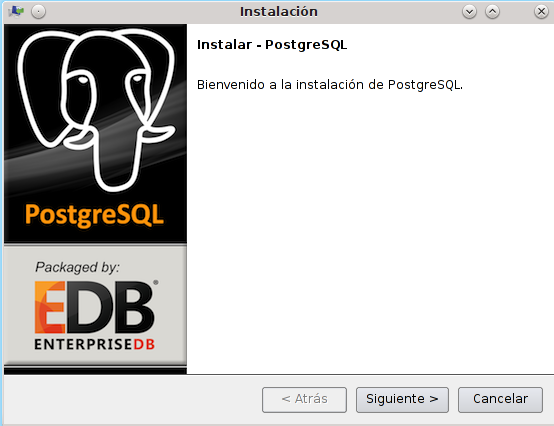
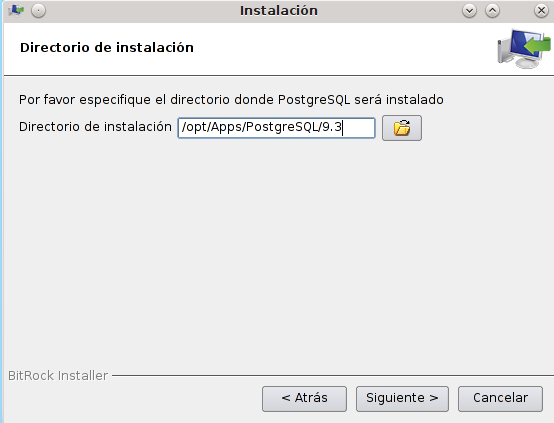
.. |Contraseña para Usuario de root de PostgreSQL| image:: resources/password-for-postgresql-root-user.png
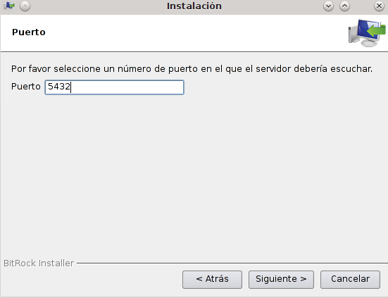
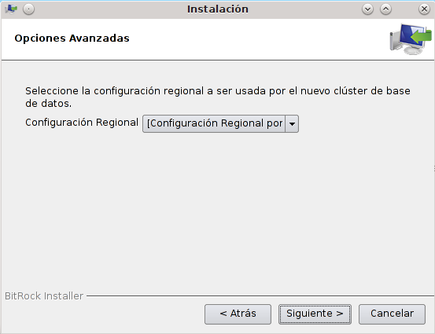
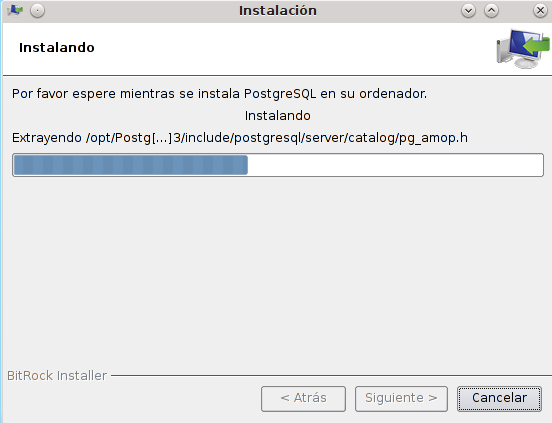
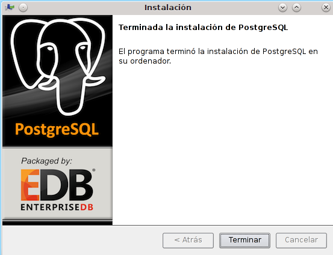
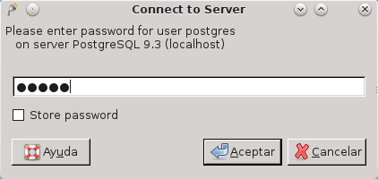
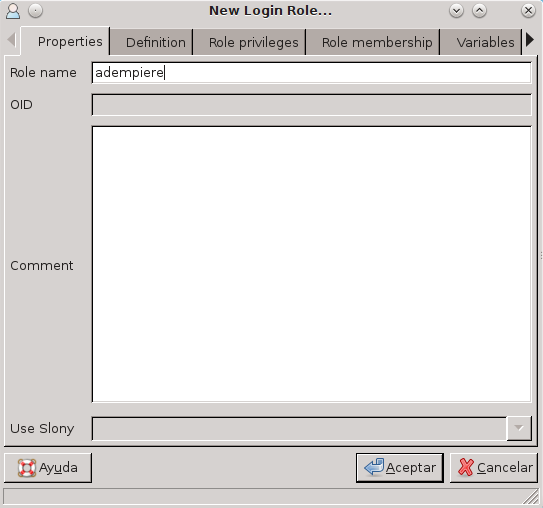
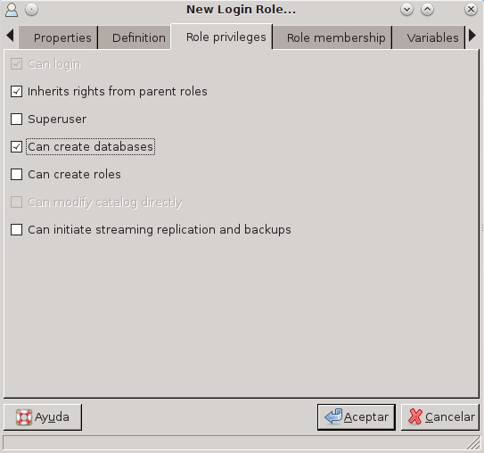
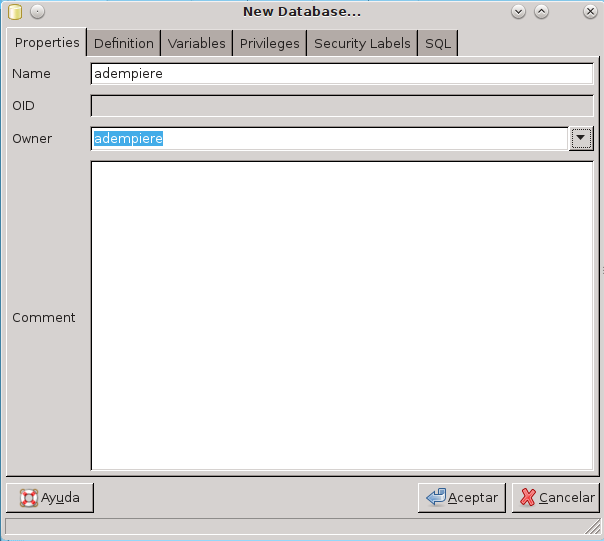
.. |Opción AdempiereXXXLTStargz| image:: resources/adempierexxxltstargz-option.png
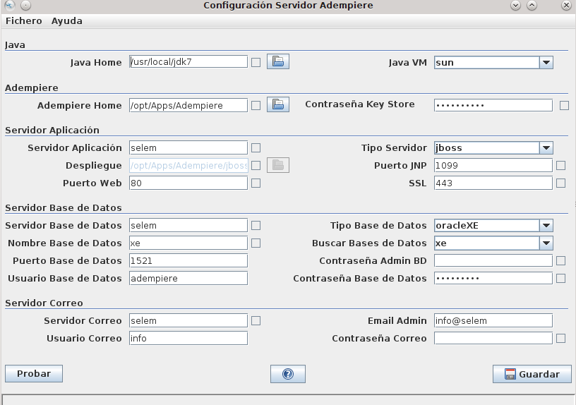
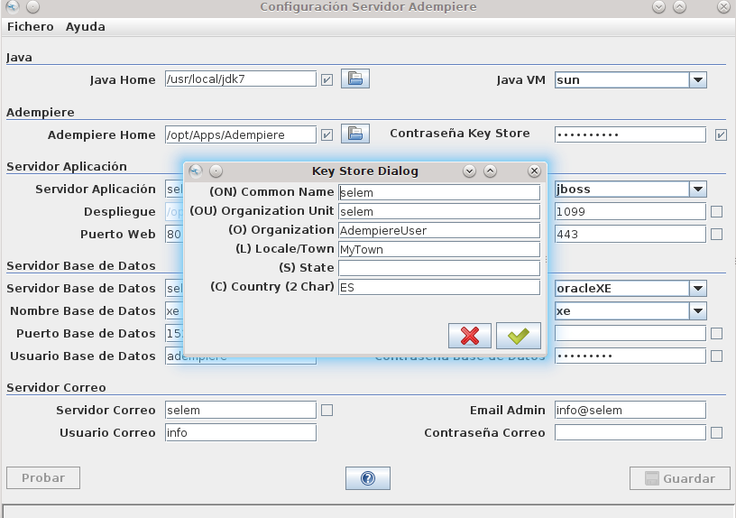
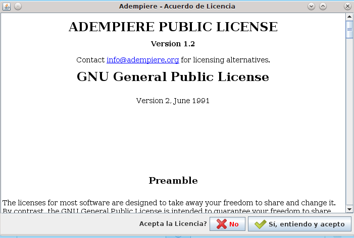
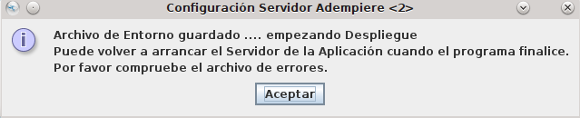
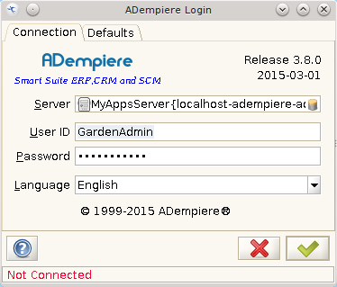
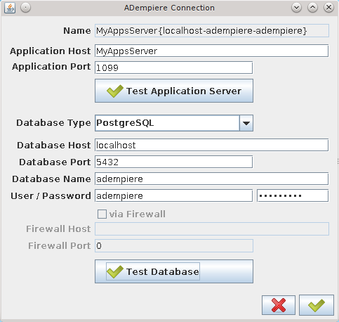

.. _documento/instalación-y-configuración-de-adempiere:

**Instalación y Configuración ADempiere**
=========================================

**Requisitos de Instalación**
-----------------------------

    - `PostgreSQL versión 9.x.x.`_
    - `JDK 1.x.x.`_
    - `ADempiere 3.x.`_

**Instalación de PostgreSQL**
-----------------------------

Una vez descargado el instalador de PostgreSQL 9.x, ejecute como usuario root.

    |Instalador PostgreSQL|

    Imagen 1. Instalador PostgreSQL

Al presionar el botón "Siguiente" aparecerá una ventana donde se debe configurar la ruta de instalación del postgreSQL.

    |Ruta de Instalador PostgreSQL|

    Imagen 2. Ruta de Instalador PostgreSQL

Luego deberá escribir una contraseña para el usuario root de PostgreSQL.

    |Contraseña para Usuario de root de PostgreSQL|

    Imagen 3. Contraseña para Usuario de root de PostgreSQL

A continuación deberá colocar el puerto donde escuchará el servidor de PostgreSQL

    |Puerto del servidor de PostgreSQL|

    Imagen 4. Puerto del servidor de PostgreSQL

En la ventana siguiente deberá seleccionar la configuración regional.

    |Configuración Regional|

    Imagen 5. Configuración Regional

Luego, se copiarán automáticamente los archivos necesarios para que PostgreSQL pueda funcionar correctamente en su equipo.

    |Archivos Necesarios para PostgreSQL|

    Imagen 6. Archivos Necesarios para PostgreSQL

Luego, terminará la instalación.

    |Terminar la Instalación|

    Imagen 7. Terminar la Instalación

**Instalación de JDK**
----------------------

#. Una vez descargado el JDK 1.X.x, abra el terminal y ubique el directorio donde se encuentra el comprimido.

    ::

        cd /opt/Install

    .. note:: 

        En este caso se colocará en “/opt/Install” quedando así: “/opt/Install/jdk-Xx-linux-x64.tar.gz”.

#. Luego descomprima el archivo jdk-Xx-linux-x64.tar.gz:

    ::

        tar xzvf jdk-7x-linux-x64.tar.gz

#. Ejecute el binario generado:

    ::

        ./jdk-7x-linux-x64.bin

#. A continuación copie el directorio creado al momento de ejecutar el binario en la ubicación /usr/local/:

    ::

        cp -r jdk /usr/local

#. Deberá otorgar permisos de ejecución al directorio copiado en /usr/local:

    ::
    
        chmod +x -R /usr/local

#. Ahora deberá agregar el java a las alternativas:

    ::

        update-alternatives --install /usr/bin/java java /usr/local/jdk/bin/java 1

#. Modifique el archivo "~/.bashrc”

    ::

        nano ~/.bashrc

Agregue las siguientes líneas al final del archivo:

    ::

        JAVA_HOME="/usr/local/jdk"
        PATH="$PATH:/usr/local/jdk/bin"
        export JAVA_HOME
        export PATH

Para finalizar, reinicie el equipo.

**Instalación de ADempiere Server**
-----------------------------------

Ejecute el PostgresSQL e indique la contraseña para el usuario "postgres", previamente configurado.

    |Ejecutar PostgresSQL|

    Imagen 8. Ejecutar PostgresSQL

Cree un usuario con el nombre adempiere en el servidor de PostgreSQL:

    |Crear Usuario con Nombre ADempiere|

    Imagen 9. Crear Usuario con Nombre ADempiere

En los Privilegios deberá seleccionar "Puede Crear Base de Datos":

    |Privilegio Puede Crear Base de Datos|

    Imagen 10. Privilegio Puede Crear Base de Datos

A continuación cree una base de datos bajo el usuario adempiere, en este ejemplo se denominará "adempiere":

    |Crear Base de Datos ADempiere|

    Imagen 11. Crear Base de Datos ADempiere

**Instalación de ADempiere**
----------------------------

Abra el siguiente enlace desde su navegador:

    http://www.adempiere.net/web/guest/download

En la sección de download debe seleccionar la opción “Adempiere_XXXLTS.tar.gz”

    |Opción AdempiereXXXLTStargz|

    Imagen 12. Opción Adempiere_XXXLTS.tar.gz

Una vez descargado ADempiere, ubique el directorio donde fue guardado.

    ::

        cd /opt/Install

.. note::

    En este caso se colocará en “/opt/Install” quedando de la siguiente manera “/opt/Install/ Adempiere_XXXLTS.tar.gz”.

Descomprima el archivo:

    ::

        tar xzvf Adempiere_380LTS.tar.gz -C /opt/Apps/

Restaure el backup que se encuentra en el directorio “/opt/Apps/Adempiere/data/”, utilizando el siguiente comando:

    ::

        /opt/Apps/PostgreSQL/9.3/bin/psql -U adempiere -W -h localhost -d adempiere < /opt/Apps/Adempiere/data/Adempiere_pg.dmp

Vaya al directorio raíz de Adempiere:

    ::
    
        cd /opt/Apps/Adempiere

Ejecute el archivo RUN_setup.sh:

    ::
    
        ./RUN_setup.sh

Aparecerá la siguiente ventana:

    |Configuración Servidor ADempiere|

    Imagen 13. Configuración Servidor ADempiere

Establezca los valores del servidor de aplicación de ADempiere, los parámetros del servidor de PostgreSQL y del correo, si lo requiere. Luego, presione el botón "Probar" (El sistema comprobará los valores).

Si todo está correcto mostrará el siguiente diálogo que deberá confirmar. 

    |Confirmar Diálogo|

    Imagen 14. Confirmar Diálogo

Presione el botón "Guardar" para comenzar la instalación, el sistema le pedirá los datos para crear la huella digital.

A continuación se le pedirá que acepte los términos de la licencia:

    |Aceptar Términos de la Licencia|

    Imagen 15. Aceptar Términos de la Licencia

Aparecerá el siguiente mensaje, indicándole que fue guardada su configuración:

    |Mensaje de Configuración Guardada|

    Imagen 16. Mensaje de Configuración Guardada

Presione el botón "Aceptar" y espere que termine la instalación, la ventana de configuración se cerrará automáticamente.

Para iniciar Adempiere se debe ubicar en el directorio:

    ::

        cd /opt/Apps/Adempiere/utils

Ejecute el archivo RUN_Adempiere.sh

    ::

        sh RUN_Adempiere.sh

    |Logo de ADempiere Cargando|

    Imagen 17. Logo de ADempiere Cargando

Inicialmente carga la ventana de login de adempiere.
Para configurar el servidor y la base de datos es necesario presionar el campo "Server".

    |Presionar Campo Server|

    Imagen 18. Presionar Campo Server

Donde mostrará una ventana con los campos requeridos para configuración:

    |Ventana con Campos Requeridos para Configuración|

    Imagen 19. Ventana con Campos Requeridos para Configuración

Para efecto de este curso se utilizará la siguiente configuración:

===============  ============ 
Campo            Valor
===============  ============ 
Database Type    PostgreSQL
Database Host    localhost
Database Port    5432
Database Name    adempiere
User / Password  adempiere
===============  ============ 

Para verificar que la conexión ha sido exitosa se debe presionar el botón "Test Database". Al estar todo ok, debe guardar la configuración.

ADempiere maneja por defecto una serie de Usuarios:

===========  ============
Usuario      Clave 
===========  ============
System       System
SuperUser    System 
GardenAdmin  GardenAdmin   
GardenUser   GardenUser
===========  ============
