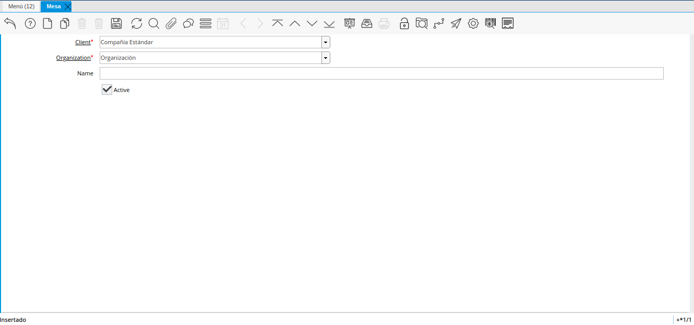
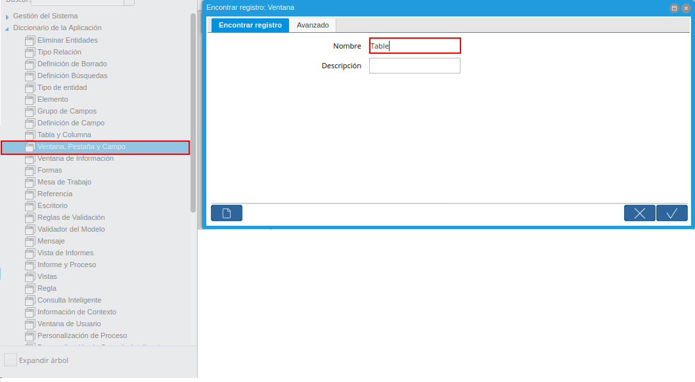
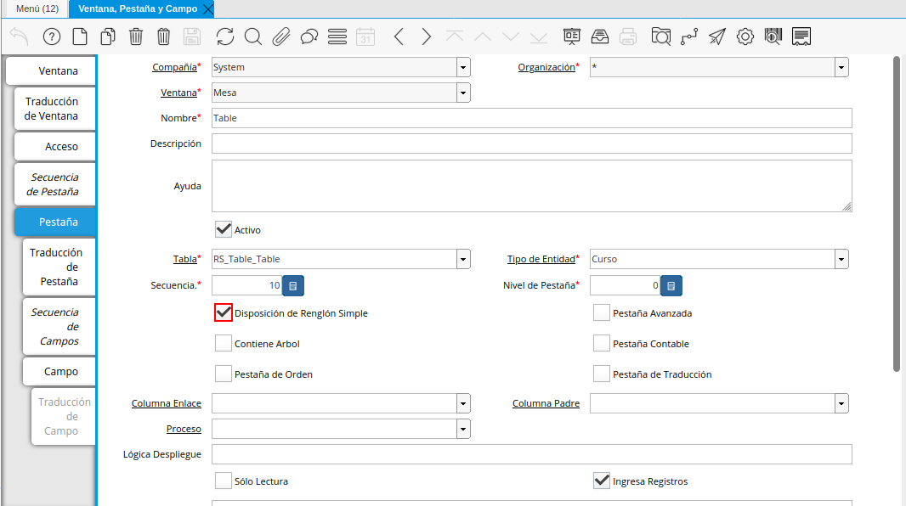
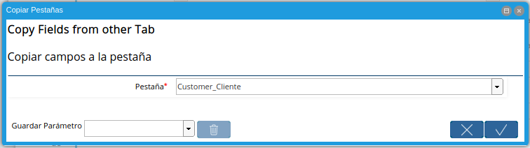
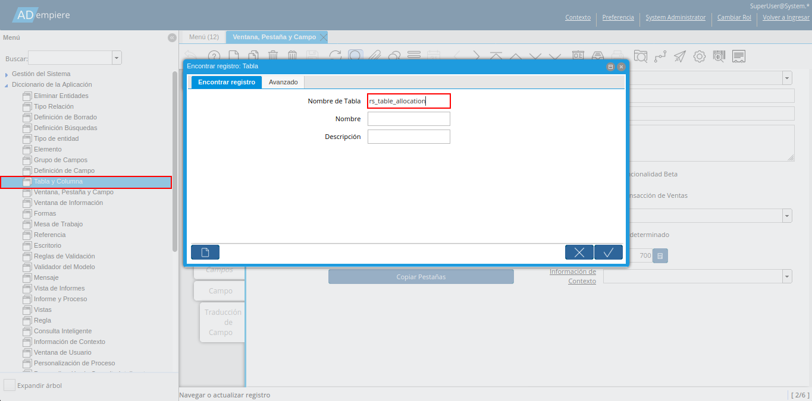
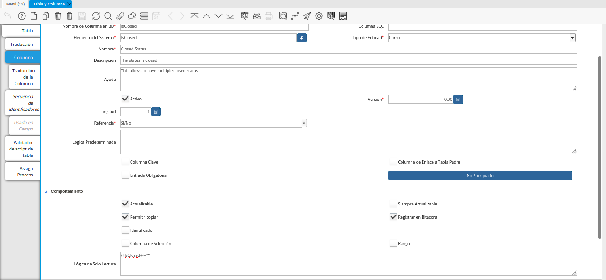
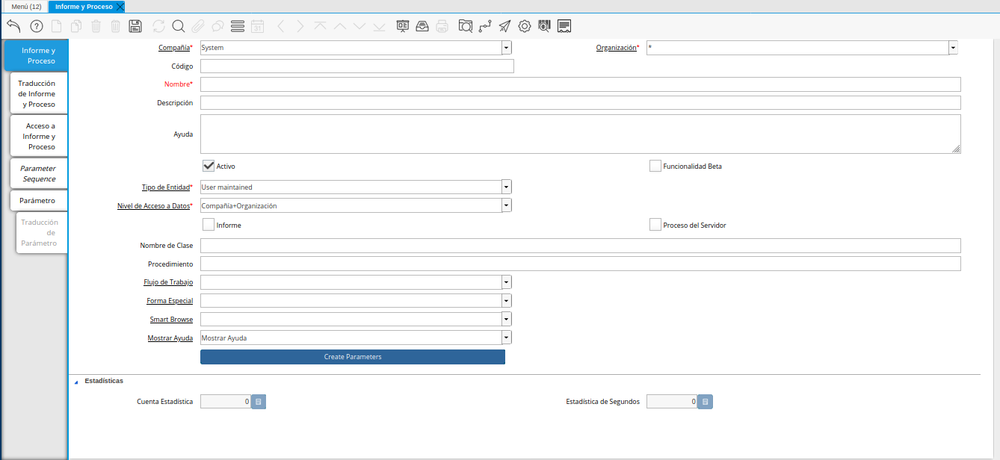

.. |Menú Formato de Impresión| image:: resources/print-format-menu.png

.. _documento/personalizando-ventanas:

**Personalizando Ventanas**
===========================

**Diseño de Columnas**
----------------------

Teniendo en cuenta que ya tiene un conocimiento básico en la creación de ventana se procede a personalizar la ventana previamente creada. El diseño quedará como lo muestra la siguiente imagen.

    |Personalizar Ventana Previamente Creada|

    Imagen 1. Personalizar Ventana Previamente Creada

Para lograr este diseño deberá ingresar nuevamente como Administrador de Sistema y acceder en "Ventana, Pestaña y Campo".

    |Acceder a Ventana Pestaña Campo|

    Imagen 2. Acceder a Ventana Pestaña Campo

Seguidamente ubicarse en "Pestaña" y seleccionar la opción "Disposición de Reglón Simple" como lo muestra la imagen

    |Pestaña y Opción Disposición de Reglón Simple|

    Imagen 3. Pestaña y Opción Disposición de Reglón Simple

Cambiar la secuencia de los campos de la siguiente manera:

    |Cambiar Secuencia de los Campos|

    Imagen 4. Cambiar Secuencia de los Campos

Luego en la pestaña de "Campo" se cambiará lo siguiente:

    ============    ==============================================
    Campo           Cambio 
    ============    ==============================================
    Compañía        Marcar check "Solo lectura" 
    Organización    Marcar check "Solo Lectura" y "Misma Línea" 
    Search Key      Colocarle al Campo "Longitud de Despliegue 20"  
    Activo          Marcar check "Misma Línea" 
    Nombre          Colocarle al Campo "Longitud de Despliegue 20"
    ============    ==============================================

**Copiar Campos**
-----------------

Ahora se verá aspecto de personalización y ampliación de la capacidad de ADempiere. Se va a seguir utilizando la plantilla del caso de uso, que se ha mencionado en el comienzo, para mapear ADempiere de capacidad y demostramos cómo podemos extender su capacidad, haciendo uso de las construcciones como modelo, proceso y callout.

Como lo mencionado en el caso de uso deberá realizar lo siguiente:

    Crear ventana para registrar los clientes (Solo la pestaña principal de socio de negocio y cliente, se debe predeterminar el campo cliente en verdadero). En este caso necesitará copiar los campos de las pestañas "Clientes" para ello se deberá crear sus respectivas pestañas.

Ahora, para crear rápidamente una copia de una pestaña existente, ADempiere proporciona un buen ahorro de tiempo a través de la característica que vamos a ver en esta sección.

Debe ingresar como  SystemAdmin con el rol de Administrador de Sistema.

Ir a "Ventana, Pestaña, Campo" y crear un nuevo registro llamado "Customer" (Cliente).

    |Menú de Ventana Pestaña y Campo|

    Imagen 5. Menú de Ventana Pestaña y Campo

Ahora debe crear una pestaña que será llamada "Customer" (Cliente), con las siguientes características:

    |Crear Pestaña Customer Cliente|

    Imagen 6. Crear Pestaña Customer Cliente

    ===============     ==========
    Campo               Valor    
    ===============     ==========
    Nombre              Customer
    Tabla               C_BPartner
    Tipo de Entidad     Curso
    ===============     ==========

Seguidamente debe presionar el botón "Copiar Pestañas", lo que le mostrará será un cuadro de diálogo donde en el campo "Pestaña" debe seleccionar "Customer" la cual será la pestaña que donde copiará los datos:

    |Cuadro de Diálogo con Campo Pestaña Customer|

    Imagen 7. Cuadro de Diálogo con Campo Pestaña Customer

Ahora se verifica los campos creados en la pestaña "Campos". Seleccionando el Campo "Customer" y comprobar que su lógica predeterminada es 'Y' como se muestra a continuación. Esto indicará que el campo "Cliente" siempre estará marcado cuando se cree un nuevo registro.

    .. note::

        La lógica predeterminada es un concepto de ADempiere útil cuando se quiere asignar un valor predeterminado a un campo. El valor predeterminado puede ser un valor estático o puede ser un valor derivado. 

    |Verificar Campos Creados en Pestaña Campos|

    Imagen 8. Verificar Campos Creados en Pestaña Campos 

Ahora deberá agregar en el menú con el nombre "Customer" como se ha explicado en el capítulo anterior.

.. note::

    Debe recordar crear las respectivas traducciones para las ventanas, pestañas e ítems del menú que ha creado.

**Resultado**
*************

El Resultado del procedimiento explicado anteriormente es el siguiente:

    |Resultado|

    Imagen 9. Resultado

**Lógica Sólo Lectura**
-----------------------

La lógica de solo lectura es utilizada para editar el comportamiento de un campo. Según el caso práctico indica que debe:

    Modificar el campo "Cerrado" de la ventana "Asignación de Mesa", el cual debe tener una lógica de sólo lectura cuando esté en verdadero.

Para realizar este paso necesita ir a "Tabla y Columna" ubicar la tabla previamente creada "RS_Table_Allocation".

    |Tabla y Columna Previamente Creada|

    Imagen 10. Tabla y Columna Previamente Creada

En la pestaña "Campo" debe seleccionar el campo "IsClosed" y modificar el campo "Lógica de Sólo Lectura" como lo muestra la imagen:

    |Pestaña Campo para Modificar el Campo Lógica de Sólo Lectura|

    Imagen 11. Pestaña Campo para Modificar el Campo Lógica de Sólo Lectura

Con este cambio ADempiere evalúa la expresión mencionada en este campo en el momento de mostrar un registro. Si la expresión se evalúa como verdadera, el campo se convierte en sólo lectura. De lo contrario, sigue siendo editable. Usted puede construir las expresiones usando las variables de contexto predefinidas en ADempiere.

**Reportes**
------------

La ventana "Reportes y Procesos" es usada para definir los parámetros y reglas de acceso para cada reporte y proceso corriendo en el sistema. Esta ventana solamente puede ser accedida por el rol System Administrator.

La ventana para el registro de los Informe y procesos en el sistema se encuentra ubicada en Menú » Diccionario de Aplicación » Informe y Procesos (Report & Process)

    |Menú Informe y Proceso|

    Imagen 12. Menú Informe y Proceso

Esta ventana está compuesta por 4 pestañas (La principal y las dependientes):

Informe y Proceso: Donde se registra el código y nombre que identifica al reporte o al proceso en el sistema y la clase, procedimiento o flujo de trabajo que contiene las funciones manejadoras del reporte o proceso.

    #. Traducción de Informe y Proceso: Donde se coloca la traducción al otro idioma del nombre del proceso (el nombre que mostrará en el menú).

    #. Acceso a Informe y Proceso: Donde se indica el rol que tendrá acceso al reporte o proceso. Por defecto está registrado System Administrator.

    #. Parámetro: Donde se definen los parámetros para el manejo de los datos en el reporte o proceso.

        #. Traducción de Parámetro

    |Ventana Informe y Proceso|

    Imagen 13. Ventana Informe y Proceso

Para registrar un reporte en ADempiere se deben colocar principalmente los siguientes datos:

    #. Código: Para que el sistema no coloque la secuencia de código por defecto para el reporte, de modo que puedas encontrarlo fácilmente.

    #. Nombre

    #. Tipo de Entidad: La entidad con que se está  identificando los datos agregados al sistema por tu customización.

    #. Nivel de Acceso de Datos: Asegúrate de que esté seleccionado Sistema+Empresa

    #. Nombre de clase: La clase manejadora de los reportes es org.compiere.report.ReportStarter

    #. Si estás trabajando con iReport (el cual es mi caso) entonces colocas el nombre del archivo jrxml donde diseñaste el reporte, esto es en el campo Reporte Jasper. Para evitar problemas al levantar el reporte entonces adjuntas el archivo jrxml desde la opción adjuntar que tiene la ventana, quedando de esta forma el dato en el campo Reporte Jasper:

        attachment:myReport.jrxml.

    #. Si los datos del reporte están siendo filtrados por unas variables específicas debes registrar esas variables en la pestaña parámetros. Seleccionando el nombre del campo en la base de datos y en el campo Elemento del Sistema se debe colocar el nombre igual al usado en la variable del reporte (en ireport).

    #. Una vez registrado el reporte deberá agregarlo en el menú para que así pueda acceder a él.

**Formato de Impresión**
------------------------

Mediante la manipulación de los formatos de impresión se pueden cambiar los documentos que genera Adempiere, para que cumplan con las normas exigidas por la ley y para hacerlos parecidos a los formatos que se manejan en las empresas.

    |Menú Formato de Impresión|

    Imagen 14. Menú Formato de Impresión

Para acceder a los formatos disponible lo hacemos por Administración del Sistema → Reglas Generales → Impresión → **Formato de Impresión**.

    |Ventana Formato de Impresión|

    Impresión 15. Ventana Formato de Impresión

Las pestañas “Orden de Despliegue” como sus nombre indica sirve para cambiar en qué orden aparecen los campos a mostrar.

    |Pestaña Orden de Despliegue|

    Imagen 16. Pestaña Orden de Despliegue

Su utilización simplemente consiste en pasar los campos de la izquierda a la derecha.

En la pestaña “Criterio de Ordenamiento” se definen las columnas por las que se desean ordenar las filas de los reportes.

    |Pestaña Criterio de Ordenamiento|

    Imagen 17. Pestaña Criterio de Ordenamiento

En la pestaña “Elemento de Formato” se definen cada uno de los campos que hacen parte del formato.  

    |Pestaña Elemento de Formato|

    Imagen 18. Pestaña Elemento de Formato

Si lo vemos en forma de tabla nos muestra los campos actualmente definidos, para modificarlos solo debemos seleccionar el campo y lo mostramos en vista de formulario.

    |Campos Actualmente Definidos|

    Imagen 19. Campos Actualmente Definidos

Manipulando estos campos podemos modificar el formato, por ejemplo puede cambiar el logo que aparece por defecto y poner el logo de su compañía.

Los siguientes son los campos que debemos llenar, algunos de estos se activan o se desactivan dependiendo del “Tipo de Formato”

==============================      =========================================================================================================================================================================
Nombre                              Descripción
==============================      =========================================================================================================================================================================
Secuencia                           Indica el orden de los registros
Nombre                              Se utiliza como referencia para hacer busqueda
Nombe a ser Impreso                 El nombre a ser impreso indica el nombre que será impreso en el documento
Impresión Etiqueta                  Subfijo indica el nombre que será impreso después del campo.
Mantenido Centralmente              Se utiliza para mantener la traducción del elemento.
Suprimir Nulos                      Si el elemento de la columna a imprimir es nulo; el suprimir nulo causa que el campo nulo y su título no sean impreso.
Tipo de Formato                     Es una lista de selección para indicar el tipo de formato que será impreso
Columna                             Se utiliza para indicar la columna de la tabla
Anchura de la línea                 Indica el ancho físico de las líneas
Formato de Impresión incluido       Permite escribir las líneas de detalles del documento
Archivo de Imagen                   Check para indicar la columna de la base de datos con la url de la imagen a mostrar
Imagen Adjunta                      Check para indicar que la imagen está adjunta en el registro
Url de la imagen                    indica url externa a la base de datos
Área                                Indica el área de impresión para este ítem
Posición Relativa                   La posición relativa del ítem es determinado por el espacio X-Z y la próxima línea
Fijar Posición NL                   Si es habilitada la posición actual X (horizontal) antes de imprimir el ítem es guardada. La próxima línea usará esta posición X; Permitiendo la impresión por columnas. 
Posición X                          Posición absoluta  X en 1/72 pulgada
Posición Y                          Posición absoluta  Y en 1/72 pulgada
Proxima Linea                       Si no se marca el ítem es impreso en la misma línea
Próxima Página                      Antes de imprimir esta columna; habrá un cambio de página
Alineación de línea                 Es usado para posicionamiento relativo del texto (centro, derecha o izquierda)
Alineación del Campo                Indica la alineación de los campos, el valor por defecto depende del tipo de dato a mostrar
Espacio X                           Espacio Relativo  X en 1/72 de pulgada en relación al ítem anterior
Espacio Y                           Espacio Relativo  Y en 1/72 de pulgada en relación al ítem anterior
Máximo Ancho                        Máximo ancho del elemento medido en 1/72 de pulgada. Si se indica 0; no hay restricción
Ancho Fijo                          Indica ancho fijo de la columna independientemente del contenido
Tipo de Formato                     Se puede seleccionar como campo, linea, rectangulo, texto fijo o una imagen
Máxima Altura                       Máximo Altura del elemento medido en 1/72 de pulgada. Si se indica 0; no hay restricción
Una Línea                           Si la columna tiene restricción de ancho; el texto es dividido en líneas múltiples. Si una línea es seleccionado; solamente la primera es impresa.
Impresión a Color                   Color usado para imprimir
Fuente de Impresión                 Tipo de Fuente usado para imprimir
Ordenado por                        Los registros son ordenados por el valor de esta columna
Calcular Sumatoria                  Calcula la suma total de los datos si el campo es numérico; de otra manera calcula la longitud total del campo.
Calcular Conteo                     Calcula el Número total de elementos no vacíos;
Calcular Mínimo                     Calcula el valor mínimo de los campos
Calcular Máximo                     Calcula el valor máximo de los campos
Calcular Promedio                   Calcula el promedio de los datos.
Calcular Desviación                 La desviación estándar es una medida de dispersión
Calcular Variación                  La variación es una medida de dispersión
==============================      =========================================================================================================================================================================

Si hay campos que no están en el formato de impresión también se puede agregar otros campos para colocar elementos que no estén y que sean considerados necesarios.

Ej. Agregar a la Orden la fecha de impresión:

    Primero se debe elegir el formato de impresión que desea modificar: En este caso para las órdenes es Order_Header.

|Elegir Formato de Impresión a Modificar|

Imagen 20. Elegir Formato de Impresión a Modificar

Seguidamente se debe ubicar en la pestaña “Elemento de Formato” y hacer clic en el botón nuevo, para agregar el nuevo elemento.

    |Ubicar Pestaña Elemento de Formato|

    Imagen 21. Ubicar Pestaña Elemento de Formato

Podemos observar todos los campos disponibles, primero debe indicar el nombre, en este caso “Fecha del Documento”.

    |Ingresar Fecha del Documento en el campo Nombre|

    Imagen 22. Ingresar Fecha del Documento en el campo Nombre

En el campo “Nombre a ser Impreso” colocamos lo que deseamos que salga escrito, pero como la fecha no es algo fijo deberá utilizar una variable.

Las variables que se pueden utilizar son:

    @*PageCount@ - Total de páginas
    @*MultiPageInfo@ - "Página x de y"
    @*CopyInfo@ - Si es una copia se imprime la palabra “Duplicado”
    @*ReportName@ - Nombre del reporte
    @*Header@ - Se imprime el encabezado total, Nombre de la compañía y de La organización
    @*CurrentDate@ - La fecha actual
    @*CurrentDateTime@ - La fecha y hora actual

También puede colocar texto además de la variable como muestra la siguiente imagen.

    |Texto y Variable|

    Imagen 23. Texto y Variable

Podrá notar que en “Tipo de Formato” está seleccionado “Campo”, esto le permite seleccionar la columna de la consulta que desea imprimir, pero como la fecha no hace parte de la columna sino del sistema, entonces debe cambiar el “Tipo de Formato” a “Texto”.

    |Tipo de Formato y Columna|

    Imagen 24. Tipo de Formato y Columna

En “Área” se indica en qué parte del formato desea que salga el nuevo elemento, en este caso se seleccionará que esté en el “Pie de Página”.

    |Campo Área|

    Imagen 25. Campo Área

Finalmente podrá observar el nuevo elemento entrando a la ventana “Órdenes de Compras” y Previsualizar el documento mediante el botón “Vista Preliminar”.
