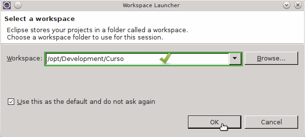
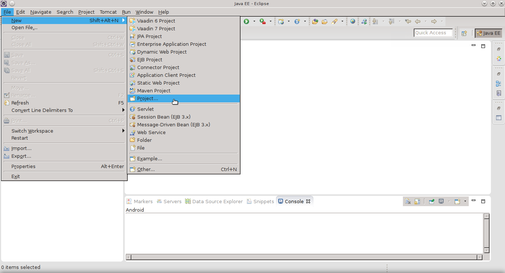
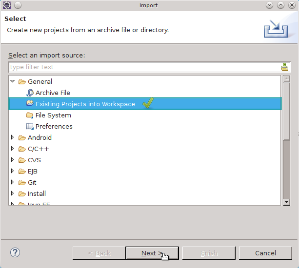
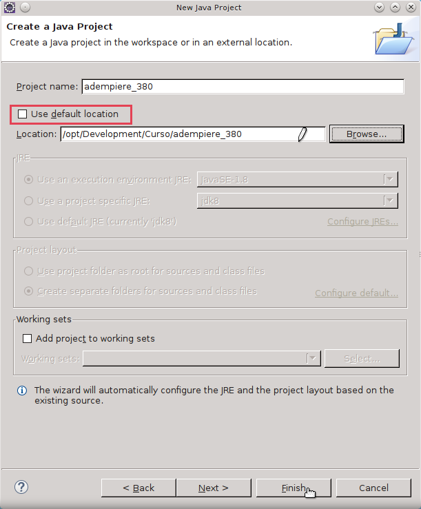

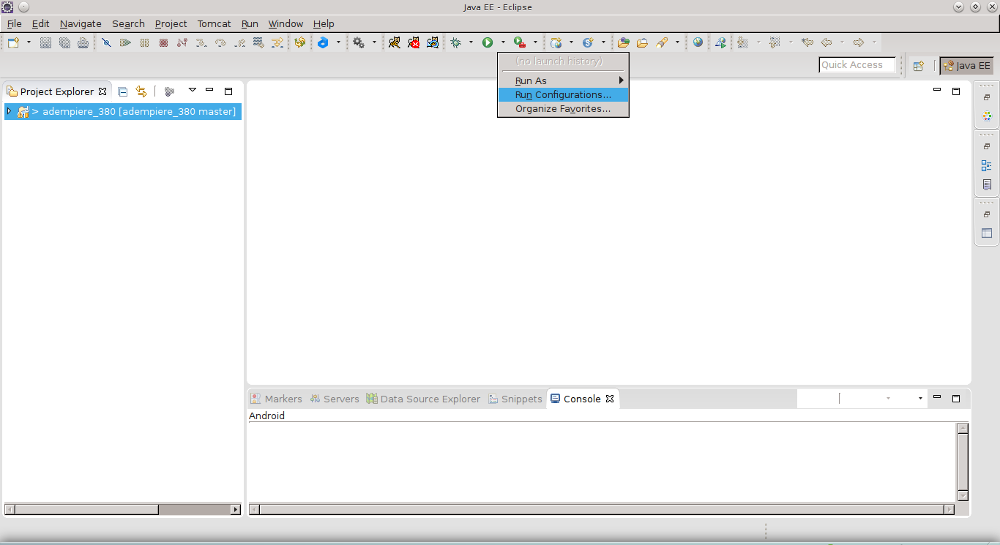

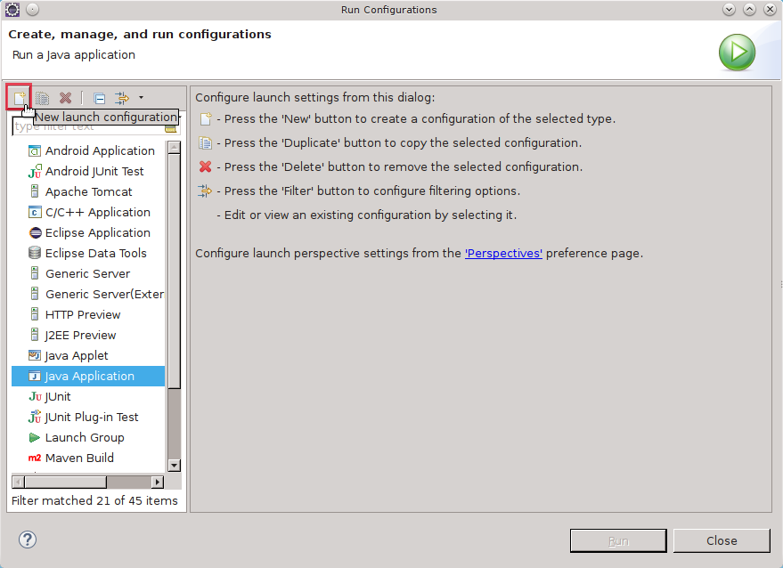
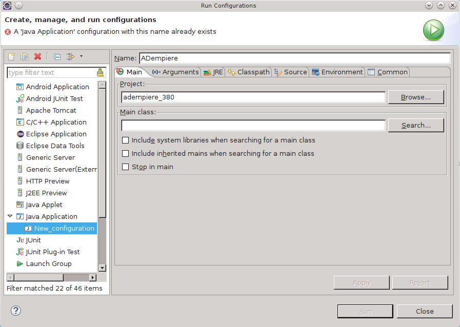
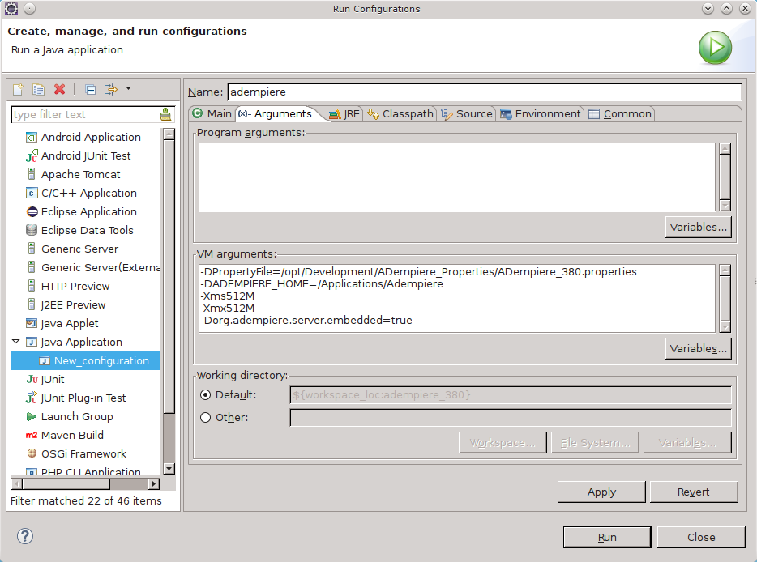
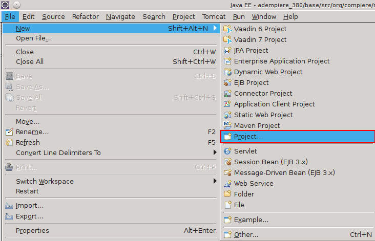
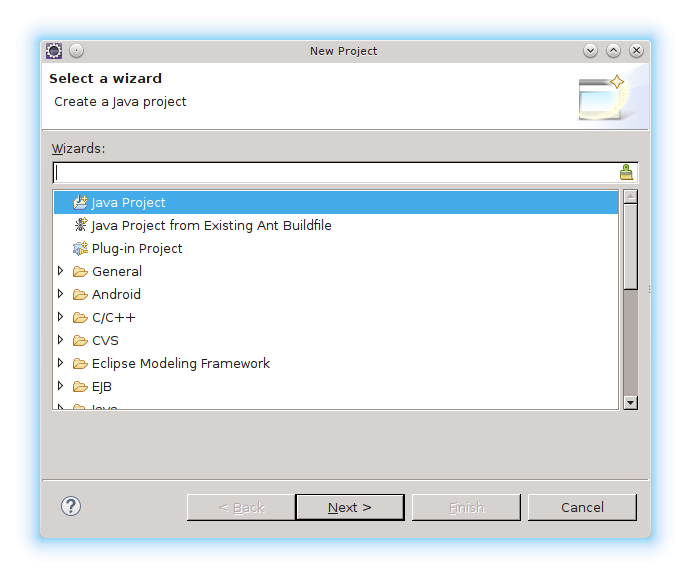
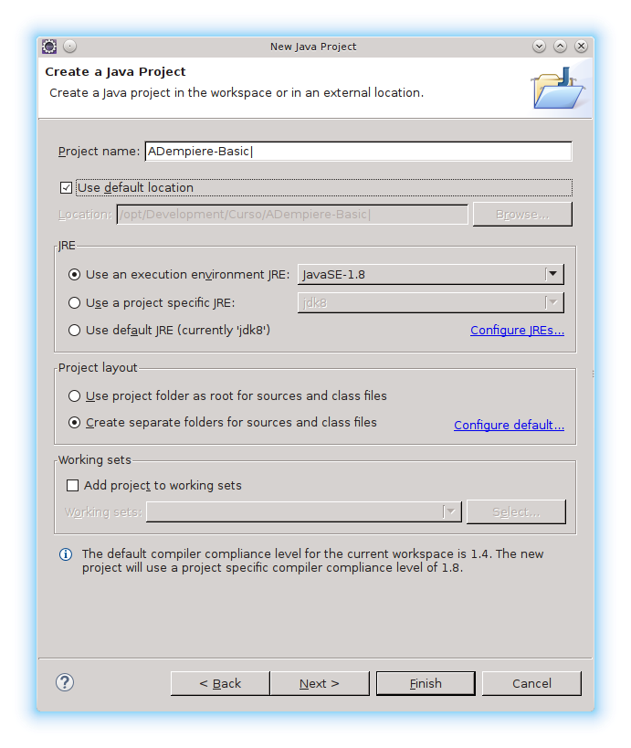
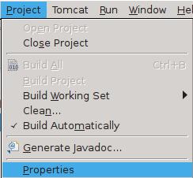
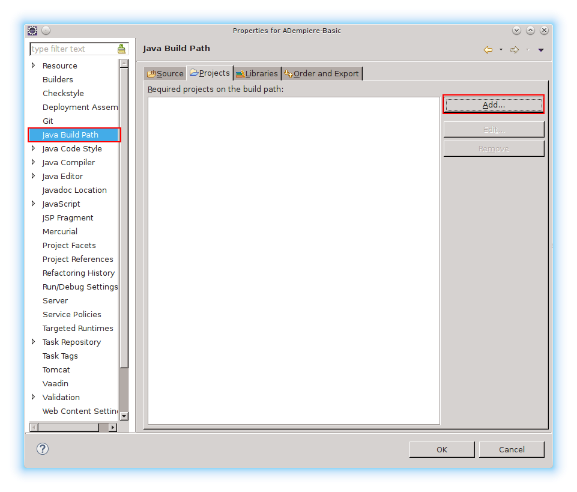
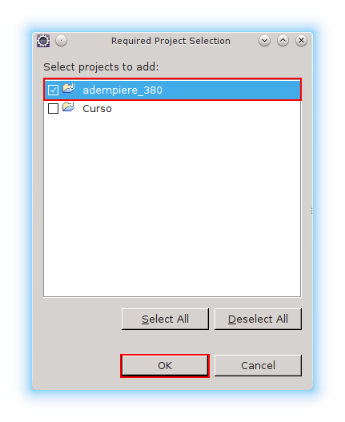
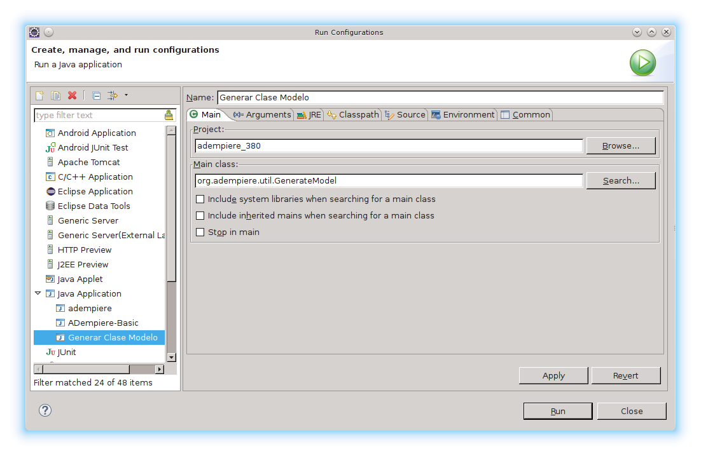
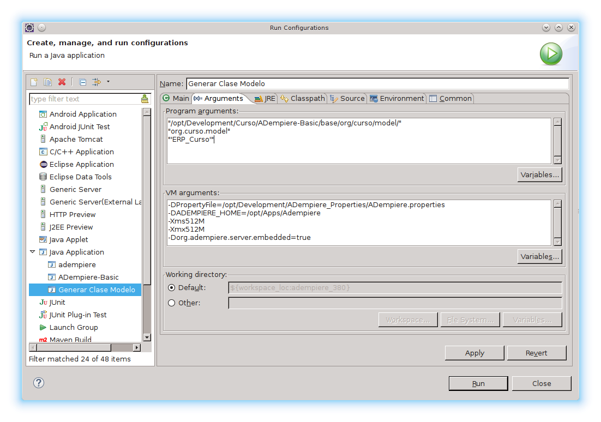
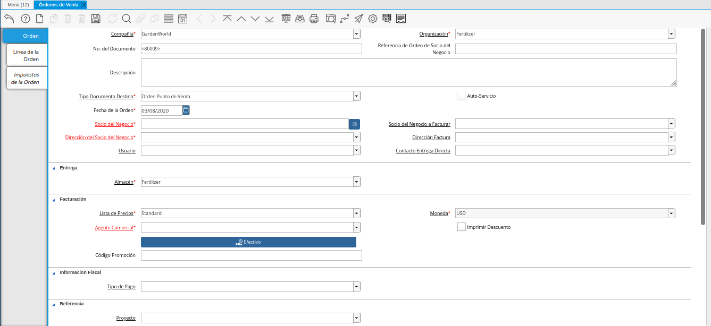
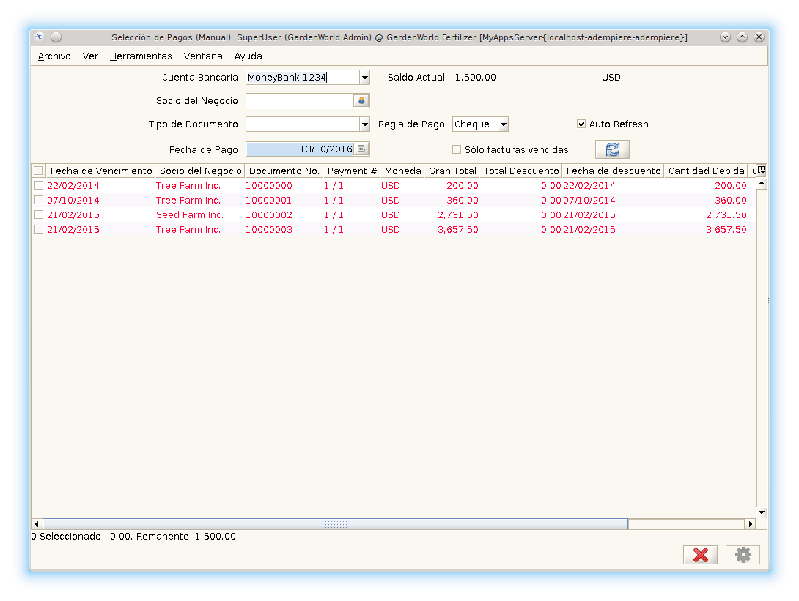
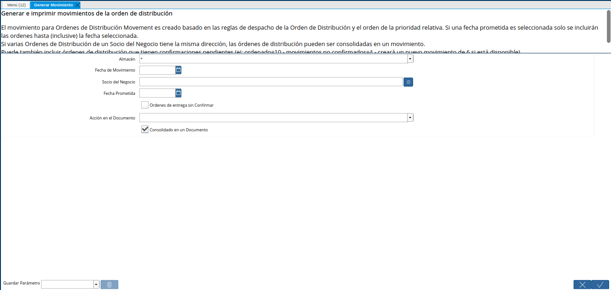
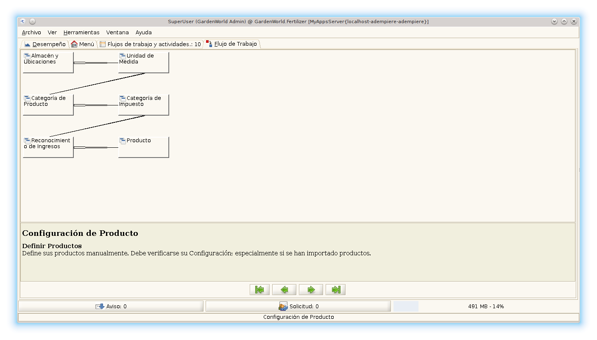
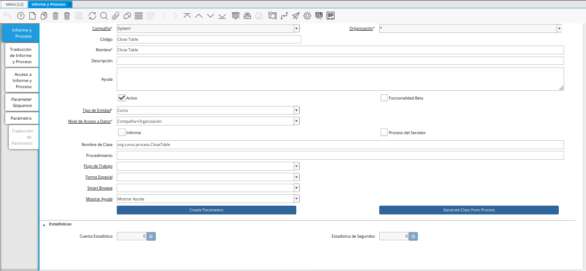
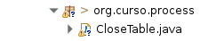

.. _documento/instalar-y-configurar-eclipse-en-gnu-linux:

**Instalar y Configurar Eclipse en GNU/Linux**
==============================================

**Instalación de Eclipse**
--------------------------

Accedemos a la página web oficial de Eclipse y descargamos la versión disponible del entorno de desarrollo para Java.

.. note:: 

    En este caso trabajaremos con la versión Luna.

**Eclipse Luna**
****************

Extraemos el contenido del archivo comprimido en la carpeta de trabajo utilizada:

::

    unzip eclipse-java-luna-SR2-win32-x86_*.zip  -d /opt/Apps

Luego debe abrir el explorador de archivo y ubicar la carpeta de instalación del Eclipse:

::

    /opt/Apps/eclipse

Para ejecutar el eclipse se le debe dar click al archivo "eclipse".

**Creando el Entorno de Desarrollo ADempiere**
----------------------------------------------

Con este objetivo en perspectiva, vamos a entender cómo configurar el entorno de desarrollo ADempiere en Eclipse y los distintos mecanismo de despliegue que se pueden aplicar al aspecto operacional de ADempiere.

La creación del entorno de desarrollo es el primer paso para convertirse en un desarrollador con ADempiere. El entorno de desarrollo le permitirá probar y depurar la aplicación y hacer cambios a la comunidad. Para probar la interfaz de usuario Web (WebUI) tendrá que seguir los pasos en la creación del espacio de trabajo Web UI usando Eclipse Webtool después de crear el entorno de desarrollo. También, se recomienda que se cree un proyecto separado para el trabajo de personalización que no será compartido con todos los usuarios de Adempiere.  

**Preparación del entorno**
***************************

Abrir el programa "Eclipse":

    |Eclipse|
    
    Imagen 1. Eclipse

Seleccionar espacio de trabajo

    .. note::

        En esta ocasión se creará una carpeta denominada "Curso", ubicada en /opt/Development/ 

    |Crear Carpeta Curso|

    Imagen 2. Crear Carpeta Curso

Para crear un nuevo proyecto, haga click en el menú  Eclipse File -> New -> Project

    |Pasos para Crear un Nuevo Proyecto|

    Imagen 3. Pasos para Crear un Nuevo Proyecto 

En el siguiente cuadro de diálogo, seleccione "Java Project" y "Next"

    |Selección de Proyecto Java y Siguiente|

    Imagen 4. Selección de Proyecto Java y Siguiente

Desactive la casilla de verificación "Use default location" y establezca la ubicación para señalar en su ubicación de repositorio de trabajo (por ejemplo /opt/development/Curso\adempiere_xxx). El asistente creará automáticamente el proyecto del fuente existente. Haga clic en "Next" y luego en "Finish".

    |Usar Ubicación Predeterminada|

    Imagen 5. Usar Ubicación Predeterminada

**Compilando ADempiere**
************************

Para compilar el proyecto y ejecutarlo se debe seleccionar el siguiente icono |Icono Reproducir| y escoger la opción "Run Configuration", como se muestra en la imagen:

    |Opción Run Configuration|

    Imagen 6. Opción Run Configuration

Se desplegará la siguiente ventana y deberá presionar el icono |Icono Nueva Configuración| para crear una nueva configuración.

    |Crear Nueva Configuración|

    Imagen 7. Crear Nueva Configuración

Seguidamente debe llenar los siguientes campos:

+-------------+---------------------------------+-------------------------+
| **Campos**  | **Descripción**                 | ** Ejemplo**            |
+-------------+---------------------------------+-------------------------+
|  Name       |  Nombre de la configuración     |  adempiere              |
+-------------+---------------------------------+-------------------------+
|  Project    |  Nombre del Proyecto a Ejecutar |  adempiere_380          |
+-------------+---------------------------------+-------------------------+
|  Main Class |  Clase Principal del Proyecto   |  org.compiere.Adempiere |
+-------------+---------------------------------+-------------------------+

|Campos Principales|

Imagen 8. Campos Principales

Luego debe seleccionar la pestaña "Arguments", ésta acción abre una ventana donde se modificará el campo de "VM Arguments". Debe agregar lo siguiente: 

::

    -DPropertyFile=/opt/Development/ADempiere_Properties/ADempiere_XXX.properties

    -DADEMPIERE_HOME=/Applications/Adempiere-Xms512M-Xmx512M
    
    -Dorg.adempiere.server.embedded=true

.. note::

    Los Argumentos de VM (Virtual Machine) son típicamente valores que cambian el comportamiento de la máquina virtual de Java (JVM). Por ejemplo, el argumento -Xmx512m permite que la pila de Java pueda crecer hasta 512 MB.

|VM Arguments|

Imagen 9. VM Arguments

Finalmente ya está configurado Adempiere y se le debe dar clic al botón "Apply" seguidamente del botón "RUN" para ejecutar el proyecto, de esta manera se desplegará la ventana de carga de ADempiere.

**Clases Modelo**
-----------------

Existen varias opciones en ADempiere para darle vida al modelo diseñado con el Diccionario de Datos. Para esto se debe entrar al código, con un poco de conocimiento en Java y en la funcionalidad de ADempiere podrá ser capaz de hacer desarrollos y personalizaciones del sistema por su propia cuenta mejorando la herramienta.

ADempiere contiene una clase llamada GenerateModel.java ubicado en el paquete org.adempiere.util.

Esta clase sirve para extender la funcionalidad de las tablas que creemos en el sistema. Con ella podemos establecer la persistencia de objeto para nuestras tablas con el fin de acceder a sus datos para Crear, Leer, Actualizar y Borrar. El modelo esta representado por las clases X_"NombreDeTabla" y las clases I_"NombreDeTabla", las cuales estan compuestas por los metodos getter y setter que nos permitiran manejar los datos de la tabla por toda la aplicacion.

Las clases X_"NombreDeTabla" extienden de la clase PO (Persistent Object) e implementan las clases (interfaces) I_"NombreDeTabla" correspondiente y la clase I_Persistent

.. note::

    En programación, entendemos por Persistencia de Objeto (PO) a: "La acción de preservar la información de un objeto de forma permanente, y a su vez poder recuperar la información del mismo para ser utilizada nuevamente en diferentes propósitos"

**Antes de Empezar**
********************

Debe crear un proyecto java, esto es con la finalidad de no modificar el fuente base de ADempiere, además es considerada una buena práctica a la hora de hacer customizaciones de proyectos.

    #. Debe ubicarse en el menú de eclipse, la opción File -> New -> Project...

        |Ruta Archivo, Nuevo, Proyecto|

        Imagen 10. Ruta Archivo, Nuevo, Proyecto

    #. En el cuadro de diálogo desplegado deberá seleccionar la opción "Java Project". Y Presionar el botón "Next"

        |Opción Java Project|

        Imagen 11. Opción Java Project

    #. Seguidamente colocarle el nombre al proyecto. Para este ejemplo se colocará "ADempiere-Basic" y presionar el botón "Finish".

        |Nombre del Proyecto|

        Imagen 12. Nombre del Proyecto

Una vez creado el proyecto debe modificar sus propiedades e indicarle que depende del proyecto de "ADempiere_380", debe ubicarse en el menú de eclipse en la siguiente opción: Project -> Properties

    |Dependencia del Proyecto|

    Imagen 13. Dependencia del Proyecto

Luego ingresar en la opción "Java Build Path" y presionar el botón agregar.

    |Java Build Path|

    Imagen 14. Java Build Path

En el cuadro de diálogo desplegado se debe seleccionar el proyecto "adempiere_380" y presionar el botón "Ok" como se muestra a continuación.

    |Selección de Proyecto y Opción OK|

    Imagen 15. Selección de Proyecto y Opción OK

Finalmente se utilizará este proyecto para ejecutar ADempiere.

**Generar Clases Modelo**
*************************

**Pasos a seguir para generar las Clases Modelo**
+++++++++++++++++++++++++++++++++++++++++++++++++

    #. Desde el entorno de desarrollo (eclipse), ir a la opción para correr o ejecutar el programa "RUN" y seleccionar la opción "RUN CONFIGURATIONS"

    #. Crear una configuración para Generar las Clases.

        |Crear Configuración para Generar las Clases|

        Imagen 16. Crear Configuración para Generar las Clases

    #. Ir a la pestaña "Arguments" para indicar los argumentos validos para generar el modelo.

        |Pestaña Argumentos|

        Imagen 17. Pestaña Argumentos

    #. En el campo "Program Arguments" se ha agregado lo siguiente:

        ::

            "/opt/Develoment/Curso/ADempiere-Basic/base/org/curso/model/"

            "org.curso.model"

            "'ERP_Curso'"

        La primera linea indica la carpeta donde estarán ubicadas las clases, la siguiente indica el paquete de las clases y por ultimo se agrega el Tipo de Entidad.

        Además en el campo VM arguments fue agregado, para obtener la configuración del proyecto anterior:

            ::

                -DPropertyFile=/opt/Development/ADempiere_Properties/ADempiere.properties
                -DADEMPIERE_HOME=/opt/Apps/Adempiere
                -Xms512M
                -Xmx512M
                -Dorg.adempiere.server.embedded=true

    #. Finalmente se guardan los cambios y se presiona el botón "RUN". 

        En la consola de eclipse mostrará una serie de mensajes relacionado con la creación de las Clases Generadas. Siguiendo el caso practico la consola de eclipse debe mostrar que ha generado dos clases: 

            GenerateModel.main: Generated = 2.

        Esto es lo principal que debemos saber para trabajar con el código de ADempiere.

        .. note::

            Cada vez que agregamos un nuevo campo a cualquier tabla y vamos a necesitar manejar los datos mediante un validador, un callout o un proceso se debe generar el modelo para esa tabla que se ha modificado (En este caso actualiza las clases X_, I_ que habíamos creado previamente).

        En ADempiere una vez que hemos generado las clases X_"NombreDeTabla" podemos crear las clases M"NombreDeTabla" (las manejadoras o "Clase Manager"), puesto que estas extienden de las clases X_"NombreDeTabla".  Estas 'clases M' son clases abstractas que definen métodos como load(), save(), delete(), get_ID(), entre otros, que los podemos invocar desde nuestro código personal donde hayamos instanciado esa clase.

        Estas clases manager se usan de dos formas:

            #. Master Data Object Classes: Extienden de la clase X_"NombreDeTabla" y permiten manejar los datos maestros de una tabla determinada. Ej. MProduct extends X_M_Product

            #. Workflow Business Object: Estas permiten manejar los objetos de negocio usados para manejar los flujos de trabajo de un proceso determinado. Aparte de extender de la clase X_"NombreDeTabla" implementan la interfaz 'DocAction'. Ej. MInvoice extends X_C_Invoice implements DocAction.

        Estas son las clases que nos permiten ir más allá de la funcionalidad básica de ADempiere. En estas clases podemos definir métodos o funciones que manejaran los datos de una manera específica en el sistema. 

**Conceptualización del MVC en ADempiere**
~~~~~~~~~~~~~~~~~~~~~~~~~~~~~~~~~~~~~~~~~~

El código fuente de ADempiere está diseñado bajo el patrón MVC significa patrón Modelo-Vista-Controlador. Este patrón separa los datos y la lógica de negocio de una aplicación de la interfaz de usuario y el módulo encargado de gestionar los eventos y las comunicaciones. Esto permite reutilizar la parte lógica del código para utilizarla en diferentes vistas (interfaces). Aprovechando esa ventaja ADempiere maneja dos interfaces, una es la interfaz de escritorio desarrollada en Java y otra interfaz web basada en el Zk framework para  aplicaciones web en AJAX.

**Modelo**
^^^^^^^^^^

Representa un objeto o Java que transporta datos.  Envía a la 'vista' aquella parte de la información que en cada momento se le solicita para que sea mostrada (típicamente a un usuario). Las peticiones de acceso o manipulación de información llegan al 'modelo' a través del 'controlador'.

En ADempiere las clase modelo se extiende de la clase PO estas se definen X_”NombreTabla” que a la vez implementa una interfaz definida como I_”NombreTabla”, como se observó anteriormente estas clases son generadas desde adempiere, Para utilizarlas se debe crear la Clase Manager.

La clase PO ofrece varios métodos que se pueden sobrescribir. Estos son afterSave, beforeSave, afterDelete, y beforeDelete. 

    La sintaxis de estos métodos son:

    protected boolean afterSave (boolean newRecord, boolean success) 
    protected boolean afterDelete (boolean success) 
    protected boolean beforeSave (boolean newRecord) 
    protected boolean beforeDelete ()

El uso principal de estos métodos es para realizar tareas adicionales en un registro particular de una tabla mientras se guarda o se elimina dicho registro.

**Vista**
^^^^^^^^^

Representa la visualización de los datos que contiene el modelo en un formato adecuado para interactuar con el usuario.

Un ejemplo en ADempiere son:

    - **Window (Ventana): Orden de Venta**

        |Window (Ventana): Orden de Venta|

        Imagen 18. Window (Ventana): Orden de Venta

    - **Form (Formulario): Selección de Pago Manual**

        |Form (Formulario): Selección de Pago Manual|

        Imagen 19. Form (Formulario): Selección de Pago Manual
    
    - **Smart Browser (Ventana Inteligente): Generar Movimientos**

        |Smart Browser (Ventana Inteligente): Generar Movimientos|

        Imagen 20. Smart Browser (Ventana Inteligente): Generar Movimientos
    
    - **Work Flow (Flujo de Trabajo): Configuración de Producto**

        |Work Flow (Flujo de Trabajo): Configuración de Producto|

        Imagen 21. Work Flow (Flujo de Trabajo): Configuración de Producto

**Controlador**
^^^^^^^^^^^^^^^

Actúa tanto en modelo y la vista. Controla el flujo de datos en un objeto de modelo y actualiza la vista siempre que cambien los datos. Mantiene la vista y el modelo separado. En adempiere el controlador pueden ser definidos como: Callouts, advertencia de salvado y/o errores.

**Estructura de los directorios**
~~~~~~~~~~~~~~~~~~~~~~~~~~~~~~~~~

**Base:** En este directorio son incluidas las clases modelo, controladores y clases de utilidades que pueden ser usadas para las diferentes interfaces.

**Client:** En este directorio se encuentra las clases de la vista de la interfaz de escritorio.

**zkwebui/WEB-INF/src:** Al igual que client mantiene las clases de la interfaz web.

Cada directorio o carpeta de codigo esta compuesta por paquetes, los directorios de **Client/src y zkwebui/WEB-INF/src** mantienen estructura similar a nivel de paquete y clase.

**Nomenclatura para Paquetes**
~~~~~~~~~~~~~~~~~~~~~~~~~~~~~~

Cada paquete comienza con **org.nombreentidad.**

Para identificar entre formulario, proceso y reporte se utiliza lo siguiente

	org.nombreentidad.**form**
	org.nombreentidad.**process**
	org.nombreentidad.**report**

**Procesos**
************

Un proceso en ADempiere es una clase que se ejecuta cuando el usuario pulsa un botón en la interfaz gráfica. La clase debe extender de SvrProcess la cual contiene los métodos que regulan el funcionamiento de los procesos.

    public class CloseTable extends SvrProcess { ... }

Los principales métodos son:

    - protected void prepare() {} - Con éste método se captura el valor de los parámetros. Los parámetros que va a recibir el proceso se configura en la pestaña Parámetros de la ventana Reportes & Procesos.

    - protected String doIt() throws Exception {} - Donde se define cómo se manejarán los datos (Se realiza la programación específica de ese proceso).

    - protected void postProcess(boolean success) - Cuando el sistema entra a este 

    - método ya la transacción ha sido completada y no se puede dar vuelta atrás.

    - Este método es opcional, lo aplicas si quieres realizar alguna acción en caso

    - de que el proceso haya sido exitoso o no.

Para la creación de procesos se utiliza la ventana de Informe y proceso, al igual que para un informe se deben llenar los campos “Nombre”, “Tipo de Entidad”, “Nivel de Acceso a Datos” a diferencia que se debe colocar el “Nombre de Clase”.

En este ejemplo se debe colocar:

    |Ejemplo para Creación de los Procesos|

    Imagen 22. Ejemplo para Creación de los Procesos

	**Código:** Close Table
	**Nombre:** Close Tabe
	**Tipo de Entidad:** Curso
	**Nivel de Acceso a Datos:** Compañia + Organización
	**Nombre de Clase:** org.curso.process.CloseTable

En el eclipse se procede a crear la clase CloseTable.java en el paquete org.curso.process

    |Clase en el Paquete|

    Imagen 23. Clase en el Paquete

::

    public class CloseTable extends SvrProcess {
        // Parameter value
    private int p_AD_User_ID = 0;
        
        public CloseTable() {
        }

        @Override
        protected void prepare() {
                ProcessInfoParameter[] parameter = getParameter();
                for(int i=0; i < parameter.length; i++) {
                    String name = parameter[i].getParameterName();
                    if(name == null)
                        ;
                    else if(name.equals("AD_User_ID")) {
                        p_AD_User_ID = parameter[i].getParameterAsInt();
                    }
                }
        }

        @Override
        protected String doIt() throws Exception {
            
            List<MRSTableAllocation> tableAllocations = MRSTableAllocation.
                    getByUser(getCtx(), p_AD_User_ID, get_TrxName());
            int qty = 0;
            for(int i = 0; i < tableAllocations.size(); i++){
                if(!tableAllocations.get(i).isClosed()) {
                    tableAllocations.get(i).setIsClosed(true);
                    tableAllocations.get(i).saveEx();
                    qty++;
                }
                    
            }
                
            return Msg.getMsg(getCtx(), "Table Close ")+qty;
        }

En nuestra clase modelo MRSTableAllocation se debe crear el siguiente método:

::

    public static List<MRSTableAllocation> getByUser(Properties ctx,
                int AD_User_ID, String trxName) {

            final String whereClause = "AD_User_ID=?";
                    
            Query q = new Query(ctx, "RS_Table_Allocation", 
                            whereClause, trxName);
                    
            q.setParameters(AD_User_ID);
                    
            return (q.list());
        }
