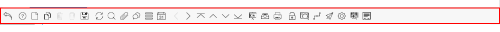

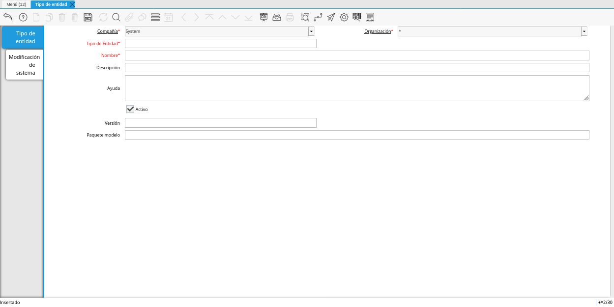
.. |Elemento| image:: resources/element.png

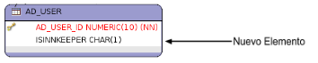
.. |Tabla y Columna| image:: resources/table-and-column.png

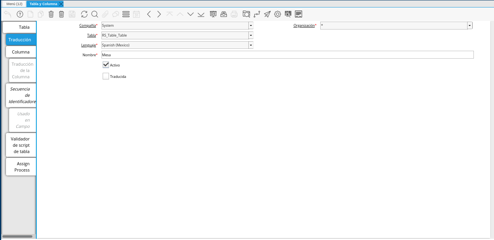
.. |Campos Requeridos de la Pestaña Columna| image:: resources/required-fields-from-column-tab.png
.. |Registro del Campo Name| image:: resources/record-the-name-field.png

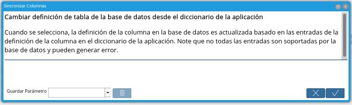
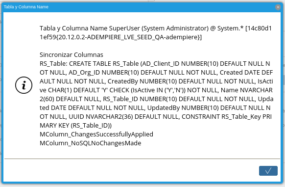
.. |Ventana Pestaña y Campos| image:: resources/tab-window-and-fields.png

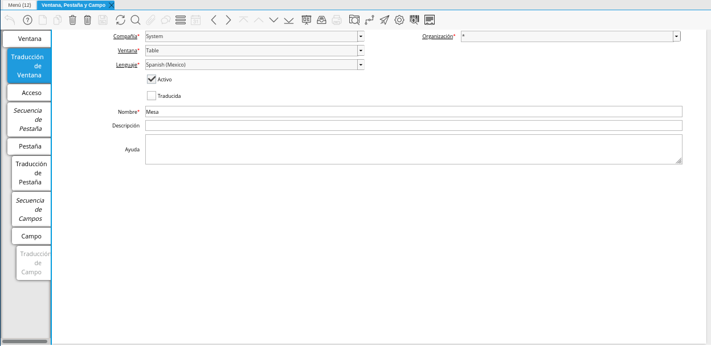
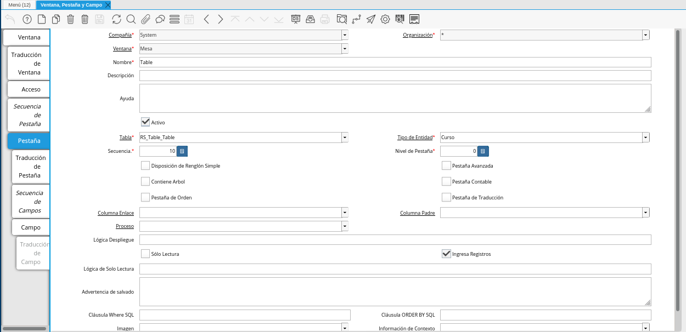
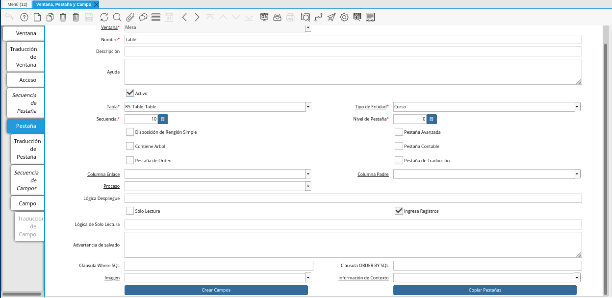
.. |Cuadro de Diálogo de Aceptación| image:: resources/acceptance-dialog-box.png
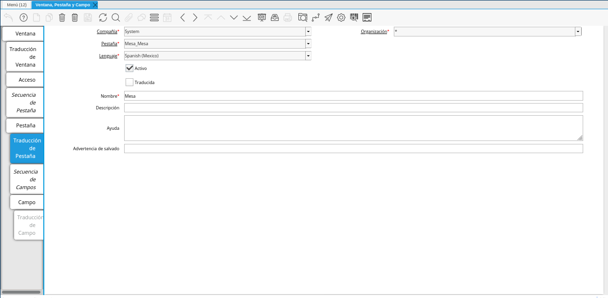
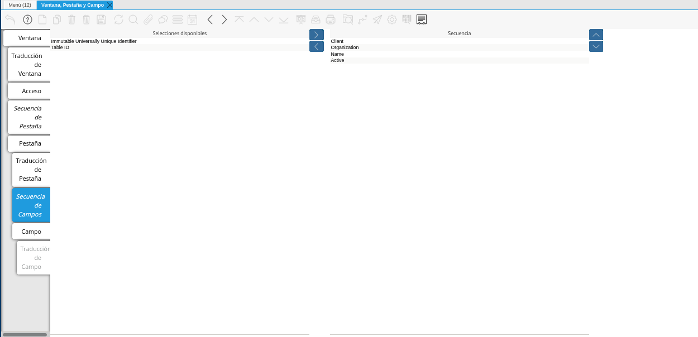
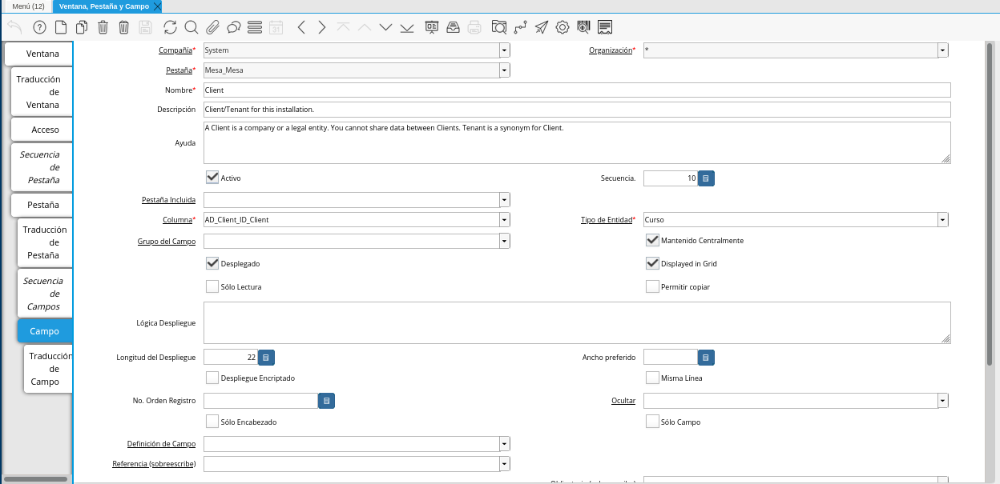
.. |Menú| image:: resources/menu.png
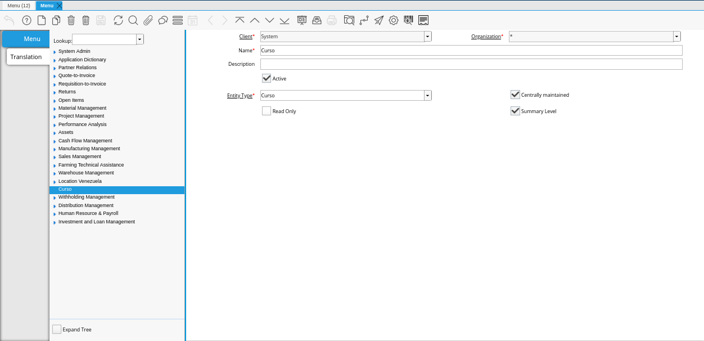

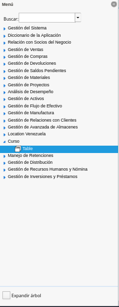

.. _documento/introducción-al-diccionario-de-aplicación:

**Introducción al Diccionario de Aplicación**
=============================================

El diccionario de aplicación es uno de los aspectos más importantes de Adempiere, prácticamente la totalidad de la aplicación se puede manejar a través de los cambios en el diccionario reduciendo considerablemente el desarrollo de código. La mayor parte de la aplicación, se puede configurar directamente en el diccionario, sin necesidad de compilación o reconstrucción del mismo.

En esta sección se describe lo siguiente:

    - Tipo de Entidad
    - Elemento
    - Tabla y Columnas
    - Ventana, pestaña y campos.

**Estructura de las Ventanas**
------------------------------

ADempiere maneja un diseño único para su ventanas, en este capítulo se explicará la estructura de las mismas: 

    - Barra de Herramientas
    - Pestañas
    - Barra de Información

**Barra de Herramientas**
*************************

ADempiere cuenta con una barra de herramientas con la que interactúa en la mayoría de las ventanas del Sistema.A continuación se explica:

    |Barra de Herramientas de ADempiere|

    Imagen 1. Barra de Herramientas de ADempiere

**Definición de Iconos**
************************

+--+----------------------------------+----------------------------------+------------------------------------------------------------------------+
|N |     Icono                        |        Nombre                    |Descripción                                                             |
+==+==================================+==================================+========================================================================+
|1 ||Ignorar Cambios|                 | Ignorar Cambios                  |Deshacer cambios realizados                                             |
+--+----------------------------------+----------------------------------+------------------------------------------------------------------------+
|2 ||Ayuda|                           | Ayuda                            |Podrá acceder                                                           |
+--+----------------------------------+----------------------------------+------------------------------------------------------------------------+
|3 ||Registro Nuevo|                  | Registro Nuevo                   |Crear nuevo registro                                                    |
+--+----------------------------------+----------------------------------+------------------------------------------------------------------------+
|4 ||Copiar Registro|                 | Copiar Registro                  |Copiar un registro a partir de un registro existente                    |
+--+----------------------------------+----------------------------------+------------------------------------------------------------------------+
|5 ||Borrar Registro|                 | Borrar Registro                  |Eliminar un registro seleccionado.                                      |
+--+----------------------------------+----------------------------------+------------------------------------------------------------------------+
|6 ||Borrar Artículos Seleccionado|   |Borrar Artículos Seleccionado     |Eliminar múltiples registros.                                           |
+--+----------------------------------+----------------------------------+------------------------------------------------------------------------+
|7 ||Guardar Cambios|                 |Guardar Cambios                   |Guardar un registro nuevo o un registro modificado.                     |
+--+----------------------------------+----------------------------------+------------------------------------------------------------------------+
|8 ||Refrescar|                       |Refrescar                         |Refrescar los registros.                                                |
+--+----------------------------------+----------------------------------+------------------------------------------------------------------------+
|9 ||Encontrar Registro|              |Encontrar Registro                |Buscar un registro en específico.                                       |
+--+----------------------------------+----------------------------------+------------------------------------------------------------------------+
|10||Anexo|                           |Anexo                             |Adjuntar archivo a un registro (Imagen, Documento, entre otros).        |
+--+----------------------------------+----------------------------------+------------------------------------------------------------------------+
|11||Comentarios|                     |Comentarios                       |Podrá realizar comentarios a un registro.                               |
+--+----------------------------------+----------------------------------+------------------------------------------------------------------------+
|12||Cambiar Multi/Mono Registro|     |Cambiar Multi/Mono Registro       |Cambio de vista a modo lista o modo unica vista.                        |
+--+----------------------------------+----------------------------------+------------------------------------------------------------------------+
|13||Registros Históricos|            |Registros Históricos              |Podrá ver un histórico de los registros (Día, Semana, Mes,Año y Todos)  |
+--+----------------------------------+----------------------------------+------------------------------------------------------------------------+
|14||Menú|                            |Menú                              |Podrá ver la ventana principal de ADempiere                             |
+--+----------------------------------+----------------------------------+------------------------------------------------------------------------+
|15||Pestaña Anterior|                |Pestaña Anterior                  |Podrá ir a la pestaña anterior de la ventana.                           |
+--+----------------------------------+----------------------------------+------------------------------------------------------------------------+
|16||Pestaña Próxima|                 |Pestaña Próxima                   |Podrá ir a la próxima pestaña de la ventana.                            |
+--+----------------------------------+----------------------------------+------------------------------------------------------------------------+
|17||Primer Registro|                 |Primer Registro                   |Podrá ir al primer registro de todos.                                   |
+--+----------------------------------+----------------------------------+------------------------------------------------------------------------+
|18||Registro Anterior|               |Registro Anterior                 |Podrá ir al registro anterior de los registros.                         |
+--+----------------------------------+----------------------------------+------------------------------------------------------------------------+
|19||Registro Próximo|                |Registro Próximo                  |Podrá ir al registro próximo de los registros.                          |
+--+----------------------------------+----------------------------------+------------------------------------------------------------------------+
|20||Último Registro|                 |Último Registro                   |Podrá ir al último registro de todos.                                   |
+--+----------------------------------+----------------------------------+------------------------------------------------------------------------+
|21||Informe|                         |Informe                           |Crear un informe fácil de todos los registros existentes.               |
+--+----------------------------------+----------------------------------+------------------------------------------------------------------------+
|22||Documentos e Informes Archivados||Documentos e Informes Archivados  |Archivar y Guardar los informes creados.                                |
+--+----------------------------------+----------------------------------+------------------------------------------------------------------------+
|23||Vista Previa|                    |Vista Previa                      |Previsualizar el documento                                              |
+--+----------------------------------+----------------------------------+------------------------------------------------------------------------+
|24||Imprimir|                        |Imprimir                          |Imprimir                                                                |
+--+----------------------------------+----------------------------------+------------------------------------------------------------------------+
|25||Visualiza Detalle|               |Visualiza Detalle(Donde es Usado) |Podrá ir a los registros en los que esté referenciado este registro.    |
+--+----------------------------------+----------------------------------+------------------------------------------------------------------------+
|26||Flujo de Trabajo Activos|        |Flujo de Trabajo Activos          |Podrá ver actividades o procesos pendiente.                             |
+--+----------------------------------+----------------------------------+------------------------------------------------------------------------+
|27||Chequee Solicitudes|             |Chequee Solicitudes               |Solicitudes de Contactos.                                               |
+--+----------------------------------+----------------------------------+------------------------------------------------------------------------+
|28||Proceso|                         |Proceso                           |Genera un proceso asociado.                                             |
+--+----------------------------------+----------------------------------+------------------------------------------------------------------------+
|29||Información de Producto|         |Información de Producto           |Podrá acceder a una consulta de producto.                               |
+--+----------------------------------+----------------------------------+------------------------------------------------------------------------+
|30||Finalizar Ventana|               |Finalizar Ventana                 |Cierra la Ventana                                                       |
+--+----------------------------------+----------------------------------+------------------------------------------------------------------------+

**Pestañas**
++++++++++++

Permite cambiar rápidamente lo que se está viendo sin cambiar de ventana que se usa en ADempiere. Una particularidad que tiene este tipo de diseño es que se pueden agregar pestañas dependientes de otras.

    |Pestañas en ADempiere|

    Imagen 2. Pestañas en ADempiere

    #. Pestaña Padre.
    #. Pestaña Dependiente.

**Barra de Información**
++++++++++++++++++++++++

La barra de información está ubicada en la parte inferior de la ventana. Se divide en dos partes como se muestra en la siguiente imagen.

    |Barra de Información de Adempiere|

    Imagen 3. Barra de Información de ADempiere

    #. Muestra Información referente a la ventana; acciones realizadas, mensajes informativos, de alertas y errores.
    #. Indica el registro donde está posicionado y la cantidad de registros existentes para la ventana.

**Caso Práctico de Estudio**
----------------------------

Para comenzar con ADempiere se utilizará el siguiente diagrama E-R como ejemplo, a fines didácticos  y uso durante todo el taller. 

Reservación de Mesas:

    |Reservación de Mesas|

    Imagen 4. Reservación de Mesas

En base al modelo se requiere:

    #. Crear ventana de "Mesas" y "Asignación de Mesa".
    #. Crear los clientes (Solo la pestaña principal de socio de negocio y cliente, se debe predeterminar el campo cliente en verdadero).
    #. Modificar el campo "Cerrado" de la ventana  "Asignación de Mesa", el cual debe tener una lógica de solo lectura cuando esté en verdadero.
    #. Crear Ventana para registrar mesonero (Pestaña principal socio del negocio, pestaña de empleado y pestaña de usuario).
    #. Crear campo de "Asignación de Mesa" en "Orden de Venta" (Solo Mostrar las asignaciones de mesas abiertas que no estén asignadas a otras órdenes de venta completas o cerradas).
    #. En la "Orden de Venta" solo debe mostrar el socio de negocio (Cliente) de la asignación de mesa y el mesonero de la asignación de mesa.
    #. Agregar al Formato de impresión de la orden de venta la mesa donde se emitió la orden.
    #. Crear reporte de pedidos por Mesa.
    #. Crear reporte de Pedidos por Mesonero, indicando en qué mesa se atendió.

**Tipo de Entidad**
-------------------

    |Tipo de Entidad|

    Imagen 5. Tipo de Entidad

El tipo de entidad determina la propiedad de las entradas del diccionario de aplicación.

En ADempiere el tipo de entidad "USER MAINTAINED" protegerá las tablas que se creen para que no sean sobrescritas en futuras migraciones. Las tablas creadas con el tipo de entidad "DICTIONARY" son sujeto de migraciones. 

.. note::

    Los tipos de entidad "Dictionary" y "Adempiere" no deben ser utilizados  debido a que este es el diccionario oficial de la comunidad de Adempiere. El tipo de entidad, también es utilizado para buscar las clases del modelo en base a los tipos de entidad (ej. org.compiere.model).

**Ventana de Tipo de Entidad**
******************************

    |Ventana de Tipo de Entidad|

    Imagen 6. Ventana de Tipo de Entidad

Datos de Ejemplo:

+-----------------------+-----------------------+-----------------------+
| **Nombre**            | **Descripción**       | **Ejemplo**           |
+-----------------------+-----------------------+-----------------------+
| Cliente               | Cliente / Inquilino   | System                |
|                       | para esta             |                       |
|                       | instalación.          |                       |
+-----------------------+-----------------------+-----------------------+
| Organización          | Entidad de            | \*                    |
|                       | organización dentro   |                       |
|                       | del cliente           |                       |
+-----------------------+-----------------------+-----------------------+
| Tipo de entidad       | Diccionario del tipo  | ERP_Curso             |
|                       | de entidad;Determina  |                       |
|                       | propiedad y           |                       |
|                       | sincronización        |                       |
+-----------------------+-----------------------+-----------------------+
| Nombre                | Identificador         | Curso                 |
|                       | alfanumérico de la    |                       |
|                       | entidad               |                       |
+-----------------------+-----------------------+-----------------------+
| Descripción           | Descripción corta     |                       |
|                       | opcional del registro |                       |
+-----------------------+-----------------------+-----------------------+
| Comentario / Ayuda    | Comentario o          |                       |
|                       | Sugerencia            |                       |
+-----------------------+-----------------------+-----------------------+
| Activo                | El registro está      | Si                    |
|                       | activo en el sistema  |                       |
+-----------------------+-----------------------+-----------------------+
| Versión               | Versión de la         |                       |
|                       | definición de la      |                       |
|                       | tabla                 |                       |
+-----------------------+-----------------------+-----------------------+
| Paquete Modelo        | El paquete de Java de | org.curso.model       |
|                       | las clases del modelo |                       |
+-----------------------+-----------------------+-----------------------+

**Elemento**
------------

    |Elemento|

    Imagen 7. Elemento

Es el repositorio central para el nombre de los campos, descripciones y comentarios/ayudas, así como también sus traducciones. Define los nombres, etiquetas, descripciones y ayudas dependiendo del contexto. Son mantenidos centralmente (al "Sincronizar la Terminología" del sistema todos los campos toman la traducción que tenga su elemento). Si necesita una excepción se debe deshabilitar la opción "Centrally Maintained" (mantenido centralmente) en el campo (Ventana, Pestaña & Campos).

**Ventana Elemento**
********************

    |Ventana Elemento|

    Imagen 8. Ventana Elemento

Ejemplo:

    |Ejemplo de Elemento|

    Imagen 9. Ejemplo de Elemento

Para la creación de un elemento se requiere:

.. note:: 

    Los campos marcados con “*” son obligatorios.

+-----------------------+-----------------------+-----------------------+
| **Nombre**            | **Descripción**       | **Ejemplo**           |
+-----------------------+-----------------------+-----------------------+
| Compañía \*           | Compañía para esta    | System                |
|                       | instalación           |                       |
+-----------------------+-----------------------+-----------------------+
| Organización \*       | Entidad               | \*                    |
|                       | organizacional dentro |                       |
|                       | de la compañía        |                       |
+-----------------------+-----------------------+-----------------------+
| Nombre de Columna en  | Nombre de la columna  | IsInkeeper            |
| BD \*                 | en la base de datos   |                       |
+-----------------------+-----------------------+-----------------------+
| Nombre \*             | Identificador         | Inkeeper              |
|                       | alfanumérico de la    |                       |
|                       | entidad.              |                       |
+-----------------------+-----------------------+-----------------------+
| Nombre a ser Impreso  | Indica el nombre a    | Inkeeper              |
| \*                    | ser impreso en un     |                       |
|                       | documento o           |                       |
|                       | correspondencia       |                       |
+-----------------------+-----------------------+-----------------------+
| Descripción           | Descripción corta     |                       |
|                       | opcional del registro |                       |
+-----------------------+-----------------------+-----------------------+
| Comentario            | Ayuda; Comentario o   |                       |
|                       | Sugerencia            |                       |
+-----------------------+-----------------------+-----------------------+
| Activo                | El registro está      | Si                    |
|                       | activo en el sistema  |                       |
+-----------------------+-----------------------+-----------------------+
| Tipo de Entidad \*    | Tipo de Entidad       | Curso                 |
|                       | Diccionario;          |                       |
|                       | determina propiedad y |                       |
|                       | sincronización        |                       |
+-----------------------+-----------------------+-----------------------+
| Referencia            | Referencia del        | Si/No                 |
|                       | Sistema y Validación  |                       |
+-----------------------+-----------------------+-----------------------+
| Longitud              | Longitud de la        | 1                     |
|                       | columna en la base de |                       |
|                       | datos                 |                       |
+-----------------------+-----------------------+-----------------------+
| Nombre en OC          | Nombre en pantalla de |                       |
|                       | orden de compras      |                       |
+-----------------------+-----------------------+-----------------------+
| Nombre a Imprimir en  | Nombre a Imprimir en  |                       |
| OC                    | OC                    |                       |
+-----------------------+-----------------------+-----------------------+
| Descripción en OC     | Descripción en OC     |                       |
+-----------------------+-----------------------+-----------------------+
| Ayuda en OC           | Ayuda en OC           |                       |
+-----------------------+-----------------------+-----------------------+

**Pestaña de Traducción**
*************************

+-----------------------+-----------------------+-----------------------+
| **Nombre**            | **Descripción**       | **Ejemplo**           |
+-----------------------+-----------------------+-----------------------+
| Cliente               | Cliente / Inquilino   | System                |
|                       | para esta             |                       |
|                       | instalación.          |                       |
+-----------------------+-----------------------+-----------------------+
| Organización          | Entidad de            | \*                    |
|                       | organización dentro   |                       |
|                       | del cliente           |                       |
+-----------------------+-----------------------+-----------------------+
| Elemento sistema      | Elemento sistema      | IsInkeeper            |
|                       | permite el            |                       |
|                       | mantenimiento central |                       |
|                       | de la descripción de  |                       |
|                       | la columna y ayuda.   |                       |
+-----------------------+-----------------------+-----------------------+
| Idioma                | Lenguaje para esta    | Español               |
+-----------------------+-----------------------+-----------------------+
| Activo                | El registro está      | Si                    |
|                       | activo en el sistema  |                       |
+-----------------------+-----------------------+-----------------------+
| Traducido             | Indica si esta        | No                    |
|                       | columna está          |                       |
|                       | traducida             |                       |
+-----------------------+-----------------------+-----------------------+
| Nombre                | identificador         | Mesonero              |
|                       | alfanumérico de la    |                       |
|                       | entidad               |                       |
+-----------------------+-----------------------+-----------------------+
| Imprimir texto        | El texto de la        | Mesonero              |
|                       | etiqueta que se va a  |                       |
|                       | imprimir un documento |                       |
|                       | o correspondencia.    |                       |
+-----------------------+-----------------------+-----------------------+
| Descripción           | Descripción corta     |                       |
|                       | opcional del registro |                       |
+-----------------------+-----------------------+-----------------------+
| Comentario / Ayuda    | Comentario o          |                       |
|                       | Sugerencia            |                       |
+-----------------------+-----------------------+-----------------------+
| Nombre PO             | Nombre que aparece en |                       |
|                       | las pantallas de PO   |                       |
+-----------------------+-----------------------+-----------------------+
| PO nombre Imprimir    | Nombre de impresión   |                       |
|                       | en la PO Pantallas /  |                       |
|                       | Informes              |                       |
+-----------------------+-----------------------+-----------------------+
| Descripción PO        | Descripción de las    |                       |
|                       | pantallas de PO       |                       |
+-----------------------+-----------------------+-----------------------+
| Ayuda PO              | Ayuda para pantallas  |                       |
|                       | PO                    |                       |
+-----------------------+-----------------------+-----------------------+

**Referencia**
**************

La Referencia indica el tipo de campo a desplegar, lista o validación de tabla en la ventana. La siguiente tabla muestra una lista de los tipos de campos existente manejados por ADempiere.

+-----------------------+-----------------------+-----------------------+
| **Type**              | **Tipo**              | **Descripción**       |
+-----------------------+-----------------------+-----------------------+
| Memo                  | Memo                  | Editor de texto,      |
|                       |                       | permite hasta 2000    |
|                       |                       | caracteres            |
+-----------------------+-----------------------+-----------------------+
| Product Attribute     | Atributos del         | los atributos del     |
|                       | producto              | producto              |
+-----------------------+-----------------------+-----------------------+
| Text Long             | Texto largo           | Texto largo           |
+-----------------------+-----------------------+-----------------------+
| Binary                | Binario               | datos binarios        |
+-----------------------+-----------------------+-----------------------+
| Time                  | Tiempo                | Hora                  |
+-----------------------+-----------------------+-----------------------+
| Location              | Ubicación (dirección) | Lugar / Dirección     |
+-----------------------+-----------------------+-----------------------+
| Date                  | Fecha                 | Fecha dd / mm / aaaa  |
+-----------------------+-----------------------+-----------------------+
| Yes-No                | Sí-No                 | casilla de            |
|                       |                       | verificación          |
+-----------------------+-----------------------+-----------------------+
| Number                | Número                | Número Flotante       |
+-----------------------+-----------------------+-----------------------+
| Integer               | Entero                | 10 dígito numérico    |
+-----------------------+-----------------------+-----------------------+
| FilePath              | FilePath              | Ruta del archivo      |
|                       |                       | local                 |
+-----------------------+-----------------------+-----------------------+
| FileName              | Nombre de archivo     | Archivo local         |
+-----------------------+-----------------------+-----------------------+
| Printer Name          | Nombre de la          | Nombre de la          |
|                       | impresora             | impresora             |
+-----------------------+-----------------------+-----------------------+
| URL                   | URL                   | URL                   |
+-----------------------+-----------------------+-----------------------+
| RowID                 | ROWID                 | Tipo de fila de datos |
|                       |                       | de identificación     |
+-----------------------+-----------------------+-----------------------+
| Color                 | Color                 | elemento de color     |
+-----------------------+-----------------------+-----------------------+
| Image                 | Imagen                | datos de imagen       |
|                       |                       | binaria               |
+-----------------------+-----------------------+-----------------------+
| Account               | Cuenta                | Elemento de Cuenta    |
+-----------------------+-----------------------+-----------------------+
| Locator (WH)          | Localizador (WH)      | tipo de almacén de    |
|                       |                       | datos de localización |
+-----------------------+-----------------------+-----------------------+
| Button                | Botón                 | botones de comando -  |
|                       |                       | inicia un proceso de  |
+-----------------------+-----------------------+-----------------------+
| Assignment            | Asignación            | Asignación de         |
|                       |                       | Recursos              |
+-----------------------+-----------------------+-----------------------+
| Chart                 | Tabla                 | Grafico               |
+-----------------------+-----------------------+-----------------------+
| FilePathOrName        | FilePathOrName        | Ruta del archivo      |
|                       |                       | local o Nombre        |
+-----------------------+-----------------------+-----------------------+
| Costs+Prices          | Costos + Precios      | precisión mínima de   |
|                       |                       | divisas, pero si      |
|                       |                       | existe más            |
+-----------------------+-----------------------+-----------------------+
| Quantity              | Cantidad              | Campo Numérico        |
+-----------------------+-----------------------+-----------------------+
| Table                 | Tabla                 | Tabla Lista           |
+-----------------------+-----------------------+-----------------------+
| Amount                | Monto                 | Número con 4          |
|                       |                       | decimales             |
+-----------------------+-----------------------+-----------------------+
| List                  | Lista                 | Lista de referencias  |
+-----------------------+-----------------------+-----------------------+
| String                | Cadena                | cadena de caracteres  |
+-----------------------+-----------------------+-----------------------+
| Search                | Buscar                | Campo de búsqueda     |
+-----------------------+-----------------------+-----------------------+
| Table Direct          | Tabla Directa         | Tabla de acceso       |
|                       |                       | directo               |
+-----------------------+-----------------------+-----------------------+
| ID                    | ID                    | Identificador de 10   |
|                       |                       | dígito                |
+-----------------------+-----------------------+-----------------------+
| Date+Time             | Fecha + Hora          | Fecha con el tiempo   |
+-----------------------+-----------------------+-----------------------+
| Text                  | Texto                 | cadena de caracteres  |
|                       |                       | hasta 2000 caracteres |
+-----------------------+-----------------------+-----------------------+

**Tabla y Columna**
-------------------

    |Tabla y Columna|

    Imagen 10. Tabla y Columna

Las tablas y columnas se consideran metadata de las tablas de la base de datos traducida a la notación de ADempiere. Estas se pueden caracterizar de la siguiente forma:

**Tabla**
*********

    |Tabla|

    Imagen 11. Tabla

**Descripción de los Campos**
+++++++++++++++++++++++++++++

- El nombre de la tabla es sensible a mayúsculas y minúsculas. Al registrar una tabla en el diccionario debe tenerse en cuenta la siguiente estructura para el registro: PREFIJO_Nombre_De_Tabla
- El ID de la tabla debe tener el nombre exacto de la tabla + el sufijo ID: PREFIJO_Nombre_De_Tabla_ID
- View (Vista): Esta opción permite definir la tabla como una vista, no se necesita sincronizar con la base de datos. Se puede usar la opción "vista" para hacer la tabla de solo-lectura.
- Data Access Level (Nivel de Acceso de Datos): Usado para definir el acceso por defecto para los roles. Generalmente se coloca como Client + Organization ("Compañía + Organización")
- Maintain Change Log (Mantiene Bitácora de Cambios): Cuando se selecciona esta opción todos los cambios hechos a esta tabla son guardados en la tabla AD_ChangeLog.
- Window (Ventana): Define la ventana a la que se accederá cuando se haga un acercamiento en el campo identificador de esta tabla. Además activa la funcionalidad "zoom" (acercar). Se puede definir una ventana diferente para los procesos de compras (PO Window (Ventana OC))
- Records deleteable (Registros Eliminables): Se utiliza para habilitar o deshabilitar el borrado de registros en la base de datos.
- High Volume (Volumen Alto): Indica si se mostrará la ventana de búsqueda para seleccionar registros de esta tabla.
- Auto Complete Min Length: Se utiliza para definir la cantidad de letra para aparecer en el campo de busqueda en el menú.
- Is Document: Indica si la ventana es utilizada como un documento.
- Entity Type (Tipo de Entidad): Se indica la entidad a la cual pertenece el registro (la tabla). En el caso de los desarrollos aplicados en este manual se utilizará “Curso”.
- Create Columns from DB (Crear Columnas desde Base de Datos): Si se crea una tabla en la base de datos o realizar cualquier cambio en alguna tabla (ALTER TABLE ADD/MODIFY) se pueden traer los cambios al diccionario mediante esta opción.
- Copy Columns From Table (Copiar columnas desde la tabla): Este es el proceso más rápido para crear una tabla. Permite seleccionar una tabla similar a la que se debe crear y este proceso traerá las columnas exactas como la tiene la otra tabla renombrando el ID para que se corresponda con el nombre de la tabla nueva. Luego se puede editar las columnas (agregar / borrar / cambiar)y al finalizar solo se debe presionar el botón "Synchronize Column" (Sincronizar Columnas) para crear la tabla o añadir las columnas en la base de datos.
- Centrally Maintained (Mantenido Centralmente): Indica que tomará las traducciones que tenga definido en el Elemento.

**Columna**
***********

    |Columna|

    Imagen 12. Columna

**Descripción de los Campos**
+++++++++++++++++++++++++++++

- System Element (Elemento del Sistema): Seleccionando el ELEMENTO se heredará por defecto el nombre de la columna en la base de datos, nombre, descripción y traducción del elemento. Si se está creando una columna nueva y no hay registro de un elemento similar al que se requiere crear entonces debe hacerse el registro del nuevo elemento haciendo ZOOM (Click derecho en el campo y seleccionar la opción Acercar).
- DB Column Name (Nombre de la Columna en BD): El nombre exacto de la columna en la base de datos.
- Column SQL (Columna SQL): Usado para crear columnas virtuales. Estas muestran información general, o información de otras tablas sin la necesidad de ser agregadas como columnas reales en la base de datos. Se construyen con una sentencia SQL de la tabla principal.
- Reference (Referencia): Tipo de dato de la columna. Cada referencia corresponde a un comportamiento diferente en la interfaz. Note cuidadosamente la diferencia en Table (Tabla) y Table Direct (Tabla Directa). Table Direct necesita tener una correspondencia exacta con la tabla a la que se está refiriendo. También debe notar la diferencia entre Table y Search (Búsqueda). Para los campos con tipo de referencia Button se puede definir un proceso asociado. Para las referencias tipo monto, fecha, entero, número, cantidad, se pueden definir rangos de mínimos y máximos.
- Validation (Validación Dinámica): Permite configurar cambios dinámicos en el campo.
- Reference Key (Llave de Referencia): Se utiliza para seleccionar listas estáticas definidas para la columna específica.
- Value Format (Formato del Valor): Para columnas con el tipo de referencia String se puede definir un formato específico. El formateo de ADempiere puede forzar el uso de espacio, cualquier letra, mayúscula, minúscula, letras y dígitos, sólo dígitos, entre otros. Por ejemplo: Definir el formato para números de teléfono.
- Default Logic (Lógica Predeterminada): Permite configurar de forma predeterminada; variables de Contexto, Sentencias SQL. para definir más de lógica estas deben ser separadas por “;”
- Key Column (Columna Clave): Sólo se puede definir una columna clave por tabla (Llave primaria) Normalmente es el ID, Este campo no es mostrado a los usuarios.
- Parent Link Column (Columna de Enlace a Tabla Padre): Define la relación hijo con una o más tablas (llave foránea). Pueden haber tablas sin ID principal pero con uno o más enlaces a tablas padre (como Tablas de Acceso).
- Mandatory (Obligatorio): Indica si el campo será obligatorio.
- Updateable (Actualizable): Indica si el campo será actualizable.
- Always updateable (Siempre Actualizable): Hace que el campo sea siempre actualizable aún después de haber sido procesado.
- Encryption (No Encriptado): Solo para campos de referencia tipo String. No tiene proceso de reversión. Se puede perder datos, se necesita asegurar el ancho de la columna para que pueda guardar todos los valores actuales.
- Read only logic (Lógica de Solo Lectura): Condición para que el campo sea de solo lectura. Por defecto los campo IsActive y Processed marcan el registro como de solo lectura sin necesidad de definir la lógica aquí.
- Mandatory logic (Lógica Obligatorio): Condición necesaria para que este campo sea obligatorio.
- Identifier (Identificador): Una o más columnas (normalmente value y/o name) que serán mostradas en listas y para referencias de reportes. Los identificadores son mostrados en el orden definido con la secuencia de los campos.
- Callout: Pedazo de código (customization) para llenar otros campos o para validaciones simples. No se recomienda usarlo para validaciones.
- Selection column (Columna de Selección): Define las columnas que serán mostradas en la ventana de búsqueda.
- Translated (Traducida): Para definir traducción para una columna. En este caso se necesitará crear una tabla y una pestaña con el mismo nombre que la original pero añadiendo el sufijo _Trl y crear la tabla con la misma llama de la tabla padre, columna para el lenguaje y columna para la traducción.

**Finalmente las tablas pueden crearse**
++++++++++++++++++++++++++++++++++++++++

- Desde la base de datos hacia el diccionario de aplicación. 
- Desde el diccionario de aplicación hacia la base de datos.

Para llevar un control de las tablas ADempiere maneja una serie de prefijos para la creación de tablas, mostrado a continuación.

+-----------------------+-----------------------+-----------------------+
| **Prefijo**           | **Ingles**            | **Español**           |
+-----------------------+-----------------------+-----------------------+
| AD\_                  | Application           | Diccionario de        |
|                       | Dictionary (e.:       | aplicación            |
|                       | AD_Element)           |                       |
+-----------------------+-----------------------+-----------------------+
| A\_                   | Assets Management     | Gestión de Activos    |
|                       | (e.: A_Asset_Group)   |                       |
+-----------------------+-----------------------+-----------------------+
| ASP                   | Application Service   | Proveedor de          |
|                       | Provider (e.:         | servicios de          |
|                       | ASP_Module)           | aplicaciones          |
+-----------------------+-----------------------+-----------------------+
| B\_                   | Marketplace (e.:      | Mercado               |
|                       | B_Buyer)              |                       |
+-----------------------+-----------------------+-----------------------+
| C\_                   | Common or Core        | Núcleo común o        |
|                       | Functionality (e.:    | funcionalidad         |
|                       | C_AcctSchema)         |                       |
+-----------------------+-----------------------+-----------------------+
| CM\_                  | Collaboration         | Gestión de            |
|                       | Management (e.:       | Colaboración          |
|                       | CM_WebProject)        |                       |
+-----------------------+-----------------------+-----------------------+
| FACT\_                | Multi-Dimensional     | Cubo                  |
|                       | Cube (e.: Fact_Acct)  | Multi-Dimensional     |
+-----------------------+-----------------------+-----------------------+
| GL\_                  | General Ledger (e.:   | Contabilidad General  |
|                       | GL_Journal)           |                       |
+-----------------------+-----------------------+-----------------------+
| HR\_                  | Human Resource (e.:   | Recursos Humanos      |
|                       | HR_Payroll)           |                       |
+-----------------------+-----------------------+-----------------------+
| I\_                   | Import (e.:           | Importación           |
|                       | I_BPartner)           |                       |
+-----------------------+-----------------------+-----------------------+
| K\_                   | Knowledge Management  | Gestión del           |
|                       | (e.: K_Category)      | Conocimiento          |
+-----------------------+-----------------------+-----------------------+
| M\_                   | Material Management   | Gestión de materiales |
|                       | (e.: M_Cost)          |                       |
+-----------------------+-----------------------+-----------------------+
| PA\_                  | Performance Analysis  | Análisis de           |
|                       | (e.: PA_Report)       | rendimiento           |
+-----------------------+-----------------------+-----------------------+
| PP\_                  | Production Planning   | Planificación de la   |
|                       | (e.: PP_Order)        | producción            |
+-----------------------+-----------------------+-----------------------+
| R\_                   | Requests (e.:         | Las solicitudes       |
|                       | R_Request)            |                       |
+-----------------------+-----------------------+-----------------------+
| RV\_                  | Report View (e.:      | Ver informe           |
|                       | RV_BPartner)          |                       |
+-----------------------+-----------------------+-----------------------+
| S\_                   | Service (e.:          | Servicio              |
|                       | S_Resource)           |                       |
+-----------------------+-----------------------+-----------------------+
| T\_                   | Temporary Tables (e.: | Tablas temporales     |
|                       | T_Report)             |                       |
+-----------------------+-----------------------+-----------------------+
| W\_                   | Web (e.: W_Basket)    | Web                   |
+-----------------------+-----------------------+-----------------------+
| WS\_                  | Servicio Web          | WS_WebService         |
+-----------------------+-----------------------+-----------------------+

**Ejemplo:**
++++++++++++

Para el siguiente ejemplo debe dirigirse en ADempiere en la sección de “Diccionario de Aplicación (Application Dictionary)” -> Tabla y Columna. Seguidamente se mostrará la Búsqueda de registros: Ventana de tablas donde debe hacer clic en el botón (Nuevo registro) en la esquina inferior izquierda. |Botón Nuevo Registro|

En la siguiente imagen se muestra la creación de la tabla “RS_Table” basado en el modelo inicial.

    |Creación de la Tabla RS Table|

    Imagen 13. Creación de la Tabla RS Table

+---------------------------+-----------------------+
| **Campo**                 | **Valor**             |
+---------------------------+-----------------------+
| Nombre de la Tabla        | RS_Table              |
+---------------------------+-----------------------+
| Nombre                    | Table                 |
+---------------------------+-----------------------+
| Activo                    | Si                    |
+---------------------------+-----------------------+
| Vista                     | No                    |
+---------------------------+-----------------------+
| Nivel de Acceso a Datos   | Compañía+Organización |
+---------------------------+-----------------------+
| Mantiene Bitácoras Cambio | No                    |
+---------------------------+-----------------------+
| Registros Eliminables     | Si                    |
+---------------------------+-----------------------+
| Volumen Alto              | No                    |
+---------------------------+-----------------------+
| Tipo de Entidad           | Curso                 |
+---------------------------+-----------------------+
| Mantenido Centralmente    | No                    |
+---------------------------+-----------------------+
| Auto Complete Min Length  | 0                     |
+---------------------------+-----------------------+
| IsDocument                | No                    |
+---------------------------+-----------------------+

Para agregar la traducción de la tabla es necesario ubicarse en la pestaña “Traducción” como se muestra en la siguiente imagen.

    |Agregar Traducción de la Tabla|

    Imagen 14. Agregar Traducción de la Tabla

+-----------+-----------+
| **Campo** | **Valor** |
+-----------+-----------+
| Nombre    | Mesa      |
+-----------+-----------+
| Activo    | Si        |
+-----------+-----------+
| Traducida | No        |
+-----------+-----------+

Posteriormente se debe ubicar en la pestaña “Columna” y agregar los campos requeridos

- Name
- Value

    |Campos Requeridos de la Pestaña Columna|

    Imagen 15. Campos Requeridos de la Pestaña Columna

Una ventaja de crear columnas a partir de los elementos es que permite heredar los campos nombre de la columna en BD, nombre, descripción, ayuda, referencia y traducción del elemento mediante el campo Elemento del Sistema.

Primeramente como lo indica la imagen se registrará el campo “Name” con las siguientes características. 

    |Registro del Campo Name|

    Imagen 16. Registro del Campo Name

De igual manera, deberá realizar el mismo paso para el campo value. Al terminar de registrar todos las columnas requerida se debe hacer click en el botón “Sincronizar Columnas”

    |Botón Sincronizar Columnas|

    Imagen 17. Botón Sincronizar Columnas

Donde aparecerá el siguiente cuadro de diálogo, indica que ADempiere creará las columnas en la base de datos.

    |Cuadro de Diálogo de Creación de Columnas en la Base de Datos|

    Imagen 18. Cuadro de Diálogo de Creación de Columnas en la Base de Datos

Finalmente mostrará un mensaje donde indica el proceso realizado, en este caso el proceso fue de crear la tabla con sus respectivas columnas.

    |Mensaje de Creación de Columnas|

    Imagen 19. Mensaje de Creación de Columnas

Es necesario aplicar estos pasos para las tablas descritas en el caso práctico.

**Ventana, Pestaña y Campos**
-----------------------------

    |Ventana Pestaña y Campos|

    Imagen 20. Ventana, Pestaña y Campos

La Ventana, Pestaña y Campo Ventana define la presentación de usuario (GUI) de tablas y columnas dentro de cada ventana.

**Ventana**
***********

    |Ventana|

    Imagen 21. Ventana

**Descripción de Campos**
+++++++++++++++++++++++++

- El nombre de la Ventana es utilizado como un identificador para acceso rápido.
- Funcionalidad beta, al marcar el check se considera como Beta y no es visualizada por el usuario final.
- El Tipo de ventanas permite seleccionar entre “Solo Consulta”; como su nombre lo indica solo es utilizada para la consulta de datos, “Transacción”; sólo aparecen los registros creado / modificado por última vez 24 horas o pendiente (el usuario puede seleccionar para mostrar más con el botón de  historial) y “Mantenimiento”; Las ventanas de este tipo son de características generales.
- Copiar Pestañas: Permite copiar pestañas desde otras ventanas ya creadas.

**Pestaña**
***********

    |Pestaña|

    Imagen 22. Pestaña

**Descripción de los Campos**
+++++++++++++++++++++++++++++

- Tabla indica que la pestaña se basa en la tabla seleccionada para crear los campos.
- Crear Campos se utiliza para crear los campos de las columnas de la tabla en la pestaña.

**Ejemplo**
+++++++++++

Crear una nueva entrada en la ventana de "Ventana, Pestaña y Campo". con el nombre de "Table".

    |Crear Nueva Entrada|

    Imagen 23. Crear Nueva Entrada

Se debe agregar su respectiva traducción desde la pestaña de "Traducción de Ventana".

    |Traducción de la Ventana|

    Imagen 24. Traducción de la Ventana

Seguidamente en la pestaña "Pestaña" crear una nueva entrada con el nombre de "Table" y en el campo "Tabla" seleccionar la tabla anteriormente creada "RS_Table".

    |Crear Nueva Entrada en la Pestaña y Seleccionar Tabla Creada|

    Imagen 25. Crear Nueva Entrada en la Pestaña y Seleccionar Tabla Creada

Utilice el botón "Crear campos" para crear campos para todas las columnas de la tabla.

    |Botón Crear Campos|

    Imagen 26. Botón Crear Campos

Al presionar el campo aparecerá un cuadro de diálogo se debe dar click en continuar.

    |Cuadro de Diálogo de Aceptación|

    Imagen 27. Cuadro de Diálogo de Aceptación

De igual manera se le debe crear la traducción a la pestaña, desde la pestaña "Traducción de Pestaña".

    |Crear Traducción de la Pestaña|

    Imagen 28. Crear Traducción de la Pestaña

En la Pestaña Secuencia de Campo se puede elegir el orden de los campos.

    |Pestaña Secuencia de Campo|

    Imagen 29. Pestaña Secuencia de Campo

Seguidamente se debe seleccionar la pestaña Campo donde se puede seleccionar múltiples atributos relacionados con la vista del sistema.

    |Pestaña Campo|

    Imagen 30. Pestaña Campo

Para ver el resultado de la ventana creada es necesario continuar con el siguiente capítulo.

**Menú**
--------

    |Menú|

    Imagen 31. Menú

En ADempiere la creación de Menú se puede hacer de manera rápida, es una ventana flexible donde se pueden crear los items de carpetas llamadas "Entidad Acumulada", ventanas, procesos, reportes formularios y más... para acceder a ella se debe ir al Menú | Administración del sistema | Reglas Generales | Sistema de Reglas | Menú.

Seguidamente haga clic en el botón Nuevo registro para crear un nuevo menú y rellenar los datos, como se muestra en la siguiente captura de pantalla:

    |Botón Registro Nuevo para Crear un Nuevo Menú|

    Imagen 32. Botón Registro Nuevo para Crear un Nuevo Menú

La imagen anterior nos muestra cómo agregar una carpeta para organizar las customizaciones realizadas. Ahora se debe crear un registro para mostrar la ventana previamente creada.

    |Crear Nuevo Registro para Mostrar Ventana Creada|

    Imagen 33. Crear Nuevo Registro para Mostrar Ventana Creada

Para añadir el ítem creado a la Entidad Acumulada (Carpeta) creada, basta solamente con arrastrar y soltar en la misma.

**Resultados**
--------------

Para ver los resultados deberá volver a iniciar sesión.

    |Iniciar Sesión|

    Imagen 34. Iniciar Sesión

Esta vez se debe seleccionar el rol de GardenWorld Admin como lo muestra la imagen

    |Rol GardenWorld Admin|

    Imagen 35. Rol GardenWorld Admin

De esta manera podrá ver en el menú los nuevos elementos creados.

    |Nuevos Elementos Creados en el Menú|

    Imagen 36. Nuevos Elementos Creados en el Menú

Seleccionar la ventana y aparecerá de la siguiente forma:

    |Seleccionar Ventana para Visualizar Resultados|

    Imagen 37. Seleccionar Ventana para Visualizar Resultados

En el siguiente capítulo se explicará cómo customizar la ventana.